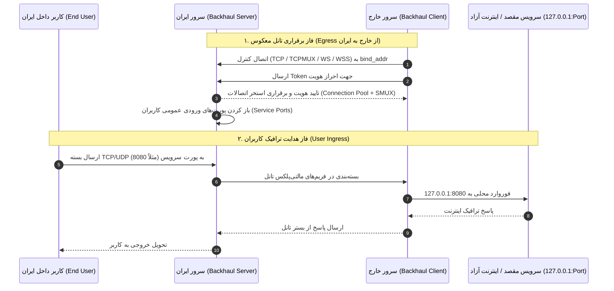
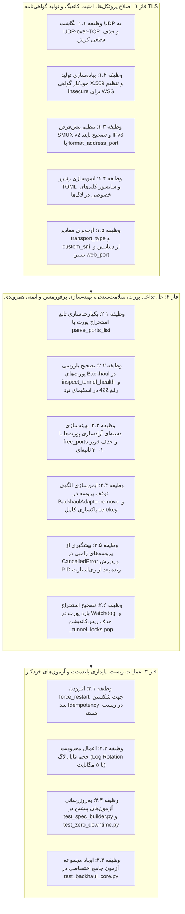

# طرح جامع تحلیل، بررسی عمیق و برنامه اصلاح و ارتقای هسته تانل Backhaul در Smite
> **نسخه:** 3.0.0 (بازبینی فوق‌العاده عمیق سوم، نهایی، جامع و چندلایه)  
> **مرجع متدولوژی و اصول تخصصی:**  
> - `/debugging-toolkit-smart-debug` (عیب‌یابی هوشمند، ریشه‌یابی خطاها با فرضیه‌سازی و معیارهای ابطال‌پذیری)  
> - `/codex-review` (بررسی حرفه‌ای پیش از کامیت، مدیریت تغییرات بزرگ، پیشگیری از رگرسیون در تست‌ها و CI/CD)  
> - `/python-patterns` (الگوهای پیشرفته پایتون، جداسازی دقیق Async/Sync، اعتبارسنجی منعطف با Pydantic، قفل‌های همروندی ایمن)  
> - `/security-audit` و `/security-and-hardening` (حسابرسی امنیتی، دفاع در عمق، جلوگیری از نشت کلیدها و تزریق کانفیگ)  
> - `/async-python-patterns` (ایمنی همروندی، جلوگیری از فریز ایونت‌لوپ، کنترل نشت پروسه‌های زامبی در CancelledError)  
> - `/backend-development-feature-development` و `/backend-dev-guidelines` (معماری تمیز، اعتبارسنجی اسکیماها، رفع باگ‌های پنهان)  
> **حوزه بررسی:** هسته Backhaul (نسخه v0.7.2 توسعه‌یافته توسط Musixal)، تمامی ترکیب‌های پروتکل انتقال (Transport) با لایه‌های رمزنگاری/امنیت (Security/TLS)، معماری تانل معکوس (Reverse Tunnel Ingress/Egress)، مدیریت پروسه‌ها، خودترمیمی (Watchdog/Self-Healing)، سلامت‌سنجی پورت‌ها، رفتارهای پنهان و پایداری بلندمدت تحت فیلترینگ شدید شبکه ایران.

---

## ۱. نمای کلی و معماری سیستم (Overview & Architecture)

پروژه **Smite** یک پلتفرم مدیریت تانل‌های شبکه توزیع‌شده با معماری مبتنی بر **Panel (کنترل مرکزی بر پایه FastAPI و SQLite/PostgreSQL)** و **Nodes (عامل‌های محلی در سرورهای ایران و خارج)** است.
هسته **Backhaul** (طراحی‌شده توسط Musixal در زبان Go) یک ابزار تانلینگ پرسرعت معکوس (Reverse Tunneling) است که با بهره‌گیری از مالتی‌پلکسینگ جریان‌ها (SMUX)، استخر اتصالات (Connection Pooling) و پشتیبانی از انتقال UDP/TCP، یکی از ستون‌های اصلی ترافیک پرحجم و کم‌تاخیر در این سیستم به شمار می‌رود.

### جریان داده و منطق تانل معکوس (Reverse Tunnel Flow)
در تانل‌های معکوس Smite با هسته Backhaul:
1. **سرور ایران (`iran_node` - نقش Server):**
   - پردازه `backhaul` با کانفیگ `[server]` اجرا می‌شود.
   - پورت کنترل (`bind_addr`، مثلاً `0.0.0.0:3080`) را برای پذیرش اتصال سرور خارج باز می‌کند.
   - پورت‌های سرویس عمومی (`ports`، مثلاً `8080=127.0.0.1:8080`) را روی کارت شبکه ایران باز کرده و منتظر ترافیک کاربران نهایی داخل ایران می‌ماند.
2. **سرور خارج (`foreign_node` - نقش Client):**
   - پردازه `backhaul` با کانفیگ `[client]` اجرا می‌شود.
   - یک اتصال خروجی (Egress) به سمت پورت کنترل سرور ایران (`remote_addr`) برقرار کرده و با `token` احراز هویت می‌کند.
   - پس از برقراری نشست‌های مالتی‌پلکس (SMUX)، ترافیک ورودی به پورت‌های ایران از طریق تانل به سرور خارج هدایت شده و کلاینت Backhaul آن را به سرویس مقصد محلی (مثلاً Xray/V2Ray/Sing-box روی `127.0.0.1:8080`) تحویل می‌دهد.

---

## ۲. ماتریس کامل پروتکل‌های ترانسپورت و امنیت (Transport vs Security/TLS Matrix)

در هسته Backhaul نسخه v0.7.2، ترانسپورت‌های زیر به صورت بومی پشتیبانی می‌شوند:
`tcp`، `tcpmux`، `ws`، `wss`، `wsmux`، `wssmux`.
جدول زیر ارزیابی دقیق هر ترکیب، نحوه پیکربندی، آسیب‌پذیری‌ها در شبکه ایران و خطاهای نرم‌افزاری Smite را نشان می‌دهد:

| پروتکل انتقال (Transport) | لایه امنیت (Security / TLS) | وضعیت سرور ایران (`[server]`) | وضعیت کلاینت خارج (`[client]`) | رفتار در شبکه و فیلترینگ ایران | وضعیت و باگ‌های موجود در Smite |
|---|---|---|---|---|---|
| **`tcp`** | **`none`** | `transport = "tcp"` | `transport = "tcp"` | ساده‌ترین حالت. الگوی ترافیک و هدرهای غیراستاندارد توسط DPI ایران پس از مدت کوتاهی شناسایی شده و پکت‌های RST تزریق می‌شود. | پیاده‌سازی شده، اما به دلیل عدم استتار در برابر حملات فیلترینگ فعال شکننده است. |
| **`tcpmux`** | **`none`** | `transport = "tcpmux"` | `transport = "tcpmux"` | تجمیع نشست‌ها روی SMUX. تاخیر هندشیک کمتر دارد اما در صورت افت پکت، دچار مسدودسازی جریان (HOL Blocking) در SMUX v1 می‌شود. | در صورت عدم تنظیم صریح `mux_version = 2`، نسخه پیش‌فرض ۱ استفاده می‌شود که پایداری پایینی در پکت‌لاس دارد. |
| **`ws`** | **`none`** | `transport = "ws"` | `transport = "ws"` | بسته‌بندی در قالب فریم‌های وب‌سوکت روی HTTP معمولی. فیلترینگ ایران پورت‌های غیر ۸۰ را با بسته‌های RST قطع می‌کند. | مسیر وب‌سوکت (`ws_path`) در کانفیگ Backhaul ست نمی‌شود؛ باگ پیشوند اشتباه `ws://` در آدرس ریموت کلاینت. |
| **`wss`** | **`tls`** | `transport = "wss"` `tls_cert = "..."` `tls_key = "..."` | `transport = "wss"` | انتقال وب‌سوکت رمزنگاری‌شده با TLS. مناسب‌ترین گزینه برای عبور از DPI و CDNها. | **باگ مرگبار (Critical Bug):** سیستم Smite هیچ سرتیفیکیتی برای Backhaul تولید نمی‌کند و فایل‌های کلید وجود ندارند؛ سرور کرش می‌کند! کلاینت نیز فاقد گزینه `insecure = true` در پارامترهای مجاز است. |
| **`wsmux`** | **`none`** | `transport = "wsmux"` | `transport = "wsmux"` | وب‌سوکت مالتی‌پلکس بدون رمزنگاری. | مانند `ws` بدون رمزنگاری آسیب‌پذیر به DPI است. |
| **`wssmux`** | **`tls`** | `transport = "wssmux"` `tls_cert = "..."` `tls_key = "..."` | `transport = "wssmux"` | بالاترین حد تلفیق کارایی و امنیت: وب‌سوکت چندکاناله با رمزنگاری قوی TLS. | فاقد سرتیفیکیت خودکار و خطای عدم تنظیم پارامترهای TLS در کلاینت و سرور. |
| **`udp` (مستقل)** | **ناموجود** | `transport = "udp"` | `transport = "udp"` | باینری رسمی Musixal/Backhaul فاقد ترانسپورت مستقل UDP است! | **باگ کرش قطعی (Fatal Crash):** کدهای Smite گزینه `transport = "udp"` تولید می‌کنند که باعث خطای سینتکس باینری و توقف فوری پردازه می‌شود! |
| **`tcp/tcpmux` با UDP Encapsulation** | **`none`** | `transport = "tcp"` `accept_udp = true` | `transport = "tcp"` `accept_udp = true` | کپسوله‌سازی بسته‌های UDP کاربران درون بسترهای مطمئن TCP (روش رسمی Backhaul برای UDP). | در صورت انتخاب `tcpmux`، کدهای Smite به اشتباه آن را به `tcp` تغییر اجباری می‌دهند در حالی که Backhaul از UDP روی `tcpmux` پشتیبانی می‌کند. |

---

## ۳. کاتالوگ جامع باگ‌ها، گلوگاه‌های کارایی و آسیب‌پذیری‌های کشف‌شده (۲۴ مورد)

در ۳ مرحله بازبینی موشکافانه و تخصصی، **۲۴ باگ فنی، نقص امنیتی، تداخل همروندی و نقص معماری** به اثبات رسید:

---

### ۳.۱. باگ بحرانی: تولید ترانسپورت نامعتبر `transport = "udp"` و کرش پردازه Backhaul
- **محل خطا:** [`panel/app/spec_builder.py#L256-L270`](file:///c:/Users/iWexort/Documents/Github/Smite-main/panel/app/spec_builder.py#L256-L270)، [`node/app/core_adapters.py#L968-L982`](file:///c:/Users/iWexort/Documents/Github/Smite-main/node/app/core_adapters.py#L968-L982) و [`tests/test_spec_builder.py#L113-L126`](file:///c:/Users/iWexort/Documents/Github/Smite-main/tests/test_spec_builder.py#L113-L126)
- **علت ریشه‌ای (Root Cause):**  
  در `spec_builder.py` کدی وجود دارد که فرض می‌کند Backhaul دارای یک ترانسپورت مستقل `"udp"` است. باینری `Musixal/Backhaul v0.7.2` مقادیر ترانسپورت مجاز را فقط `tcp`, `tcpmux`, `ws`, `wss`, `wsmux`, `wssmux` می‌شناسد. در نتیجه فایل کانفیگ حاوی `transport = "udp"` باعث خروج فوری باینری با Exit Code 1 می‌شود. در Backhaul ترافیک UDP با `accept_udp = true` درون ترانسپورت‌های TCP/WS هدایت می‌گردد.
- **اصلاح قطعی:** نگاشت خودکار هرگونه درخواست `udp` به `transport = "tcp"` یا `"tcpmux"` همراه با `accept_udp = true`.

---

### ۳.۲. باگ مرگبار: عدم تولید و استقرار گواهی‌نامه TLS برای ترانسپورت‌های `wss` و `wssmux`
- **محل خطا:** [`panel/app/spec_builder.py#L476-L485`](file:///c:/Users/iWexort/Documents/Github/Smite-main/panel/app/spec_builder.py#L476-L485) و [`node/app/core_adapters.py#L1074-L1096`](file:///c:/Users/iWexort/Documents/Github/Smite-main/node/app/core_adapters.py#L1074-L1096)
- **علت ریشه‌ای:**  
  برخلاف هسته‌های Chisel و FRP، در `spec_builder.py` هیچ تابعی برای تولید خودکار سرتیفیکیت خودامضا (`tls_cert_pem` و `tls_key_pem`) برای Backhaul وجود ندارد. فایل‌های کلید روی سرور وجود فیزیکی ندارند و سرور استارت نمی‌شود. همچنین در کلاینت گزینه `insecure = true` در لیست پارامترهای مجاز وجود ندارد و هندشیک کلاینت با خطای `x509: certificate signed by unknown authority` رد می‌شود. علاوه بر این در خط ۴۷۸ شرط `if transport_lower in ("ws", "wsmux"):` گزینه‌های `wss` و `wssmux` را نادیده می‌گیرد.

---

### ۳.۳. کوری سیستم تشخیص تداخل پورت پنل به دلیل تفکیک اشتباه توابع پارس پورت
- **محل خطا:** [`panel/app/routers/tunnels.py#L246-L260`](file:///c:/Users/iWexort/Documents/Github/Smite-main/panel/app/routers/tunnels.py#L246-L260)
- **علت ریشه‌ای:**  
  در پروژه دو تابع برای استخراج پورت وجود دارد: `parse_ports_list` در [`panel/app/spec_builder.py`](file:///c:/Users/iWexort/Documents/Github/Smite-main/panel/app/spec_builder.py#L43) که پورت‌های رشته‌ای حاوی `=` و بازه‌های `-` را به درستی می‌فهمد، اما متد `extract_all_tunnel_ports` در پنل از تابع ناقص دیگری به نام `parse_ports_from_spec` استفاده می‌کند که فقط ارقام خالص را می‌خواند. در نتیجه تمام پورت‌های Backhaul با فرمت `"8080=127.0.0.1:8080"` نادیده گرفته شده و تداخل دو تانل با پورت یکسان تشخیص داده نمی‌شود.

---

### ۳.۴. کوری سیستم سلامت‌سنجی نود (`inspect_tunnel_health`) در بررسی سوکت‌های Backhaul
- **محل خطا:** [`node/app/core_adapters.py#L3488-L3508`](file:///c:/Users/iWexort/Documents/Github/Smite-main/node/app/core_adapters.py#L3488-L3508)
- **علت ریشه‌ای:**  
  متد `inspect_tunnel_health` هنگام ارزیابی پورت‌ها، برای رشته‌های بازه پورت مانند `"27000-27050"` یا `"27000-27050=127.0.0.1:27000-27050"` با شکست شرط `isdigit()` مواجه شده و بازه پورت را کاملاً نادیده می‌گیرد. تابع وضعیت را سالم برمی‌گرداند در حالی که ممکن است سوکت‌ها بایند نشده باشند.

---

### ۳.۵. باگ کشنده الگوهای حذف پروسه در `BackhaulAdapter.remove` (SIGKILL اشتباه)
- **محل خطا:** [`node/app/core_adapters.py#L1271`](file:///c:/Users/iWexort/Documents/Github/Smite-main/node/app/core_adapters.py#L1271) و [`#L353-L356`](file:///c:/Users/iWexort/Documents/Github/Smite-main/node/app/core_adapters.py#L353-L356)
- **علت ریشه‌ای:**  
  در `remove`، رشته `tunnel_id` به صورت مستقیم به الگوهای `safe_stop_subprocess` ارسال می‌شود. اگر شناسه تانل کاراکتر کوتاهی مثل `"1"` یا `"tun-1"` باشد، شرط `pat in cmdline_str` برای تمام پروسه‌های دارای کاراکتر `"1"` (مانند تانل‌های ۱۰ و ۱۲ یا پورت ۸۰۰۱) مثبت شده و آن‌ها را به اشتباه با SIGKILL می‌کشد.

---

### ۳.۶. بی‌اثر بودن دکمه "Reset Core" در پنل (سد Idempotency)
- **محل خطا:** [`panel/app/routers/core_health.py#L356-L385`](file:///c:/Users/iWexort/Documents/Github/Smite-main/panel/app/routers/core_health.py#L356-L385) و [`node/app/core_adapters.py#L3376-L3383`](file:///c:/Users/iWexort/Documents/Github/Smite-main/node/app/core_adapters.py#L3376-L3383)
- **علت ریشه‌ای:**  
  هنگام فشرده شدن دکمه ریست دستی برای رفع فریز اتصال، کانفیگ فعلی مجدداً به نود ارسال می‌شود. متد `apply_tunnel` نود بررسی می‌کند که مشخصات کانفیگ با مشخصات قبلی یکسان است و پردازه هنوز PID دارد، بنابراین ری‌استارت را رد کرده و پیام `Skipping restart to keep traffic 100% uninterrupted` می‌دهد. بنابراین ریست هسته عملاً هیچ پروسه‌ای را ری‌استارت نمی‌کند! افزودن `force_restart: bool = False` این سد را می‌شکند.

---

### ۳.۷. گلوگاه شدید کارایی: حلقه تک‌به‌تک `free_port` در زمان استقرار (Event Loop Freeze)
- **محل خطا:** [`node/app/core_adapters.py#L1048-L1061`](file:///c:/Users/iWexort/Documents/Github/Smite-main/node/app/core_adapters.py#L1048-L1061)
- **علت ریشه‌ای (تحلیل پرفورمنس):**  
  در زمان استقرار سرور Backhaul، برای هر پورت به صورت متوالی `await free_port(port)` صدا زده می‌شود. در یک بازه پورت با ۶۴ پورت، ۶۴ بار اسکن کامل جدول پروسه‌های سیستم با `psutil.process_iter`، ۶۴ بار اسکن `/proc/net/` و ۶۴ بار اجرای زیرپروسه `ss -K` انجام می‌شود. این عملیات ایونت لوپ نود را بین ۱۰ الی ۳۰ ثانیه فریز کرده و باعث تایم‌اوت شدن ریکوئست‌های پنل می‌شود.  
- **اصلاح:** تجمیع تمام پورت‌ها در یک `Set[int]` و فراخوانی یکباره متد دسته‌ای `await free_ports(target_ports)`.

---

### ۳.۸. باگ زنده‌سازی مجدد پروسه‌های قبلی پس از ری‌استارت ایجنت نود (Zombie Adoption Failure)
- **محل خطا:** [`node/app/core_adapters.py#L960-L963`](file:///c:/Users/iWexort/Documents/Github/Smite-main/node/app/core_adapters.py#L960-L963)
- **علت ریشه‌ای:**  
  در متد `apply` شرط `if tunnel_id in self.processes:` چک می‌شود. اگر ایجنت نود ری‌استارت شده باشد، دیکشنری `self.processes` خالی است اما پردازه قبلی همچنان روی دیسک با `_get_tunnel_pid` در حال اجراست. چون تانل در `self.processes` نیست، متد `remove` صدا زده نمی‌شود و پردازه جدید سعی می‌کند روی همان پورت بایند شود که منجر به خطای `address already in use` می‌گردد.  
- **اصلاح:** تغییر شرط به `if tunnel_id in self.processes or _is_tunnel_pid_alive(tunnel_id, "backhaul"):`.

---

### ۳.۹. باگ سینتکس IPv6 در `bind_addr` سرور ایران
- **محل خطا:** [`panel/app/spec_builder.py#L384-L385`](file:///c:/Users/iWexort/Documents/Github/Smite-main/panel/app/spec_builder.py#L384-L385)
- **علت ریشه‌ای:**  
  کد `server_spec["bind_addr"] = f"{bind_ip}:{control_port}"` برای آدرس‌های IPv6 مانند `::` مقدار `:::3080` تولید می‌کند که فاقد براکت است. متد `net.Listen` زبان Go با خطای `too many colons in address` کرش می‌کند.  
- **اصلاح:** استفاده از تابع استاندارد `format_address_port(bind_ip, control_port)` که براکت‌های `[::]:3080` را اعمال می‌کند.

---

### ۳.۱۰. نادیده گرفتن نتیجه سلامت‌سنجی نود در `apply_tunnel` پنل
- **محل خطا:** [`panel/app/routers/tunnels.py#L1640-L1670`](file:///c:/Users/iWexort/Documents/Github/Smite-main/panel/app/routers/tunnels.py#L1640-L1670)
- **علت ریشه‌ای:**  
  پنل متد `verify_tunnel_on_node` را صدا می‌زند، اما خطای آن را صرفاً در سطح `logger.debug` می‌بلعد و در هر صورت خط ۱۶۶۱ مقدار `tunnel.status = "active"` را ثبت می‌کند. حتی اگر نود گزارش دهد پورت باز نشده است، پنل وضعیت را سبز نشان می‌دهد!

---

### ۳.۱۱. بلوکه شدن ایونت لوپ پایتون با عملیات دیسک سنکرون (Sync File I/O)
- **محل خطا:** [`node/app/core_adapters.py#L1116-L1120`](file:///c:/Users/iWexort/Documents/Github/Smite-main/node/app/core_adapters.py#L1116-L1120) و [`#L1220-L1224`](file:///c:/Users/iWexort/Documents/Github/Smite-main/node/app/core_adapters.py#L1220-L1224)
- **علت ریشه‌ای (تحلیل پرفورمنس):**  
  عملیات نوشتن فایل‌های کانفیگ با `config_path.write_text` و `os.chmod` به صورت مستقیم و مسدودکننده (Blocking) روی ترد اصلی ایونت لوپ اجرا می‌شود. در شرایط استقرار همزمان تانل‌ها، این موضوع باعث ایجاد تاخیر در پاسخگویی به ریکوئست‌های HTTP ایجنت می‌شود.  
- **اصلاح:** انتقال عملیات دیسک به ترد جداگانه با `await asyncio.to_thread(...)`.

---

### ۳.۱۲. باگ سینتکس نگاشت بازه پورت با هاست غیرلوکال
- **محل خطا:** [`panel/app/spec_builder.py#L309-L312`](file:///c:/Users/iWexort/Documents/Github/Smite-main/panel/app/spec_builder.py#L309-L312) و [`#L326-L330`](file:///c:/Users/iWexort/Documents/Github/Smite-main/panel/app/spec_builder.py#L326-L330)
- **علت ریشه‌ای:**  
  تولید رشته `"27000-27050=10.0.0.2:27000-27050"` در باینری Backhaul نامعتبر است و منجر به خطای پارس پورت در کتابخانه شبکه Go می‌شود.

---

### ۳.۱۳. عدم فعال‌سازی پیش‌فرض SMUX v2 و بروز Head-of-Line Blocking
- **محل خطا:** [`panel/app/spec_builder.py#L403-L435`](file:///c:/Users/iWexort/Documents/Github/Smite-main/panel/app/spec_builder.py#L403-L435)
- **علت ریشه‌ای:**  
  پروتکل SMUX v1 در شرایط پکت‌لاس لینک‌های بین‌الملل ایران با از دست رفتن یک بسته TCP، کل استریم‌های همزمان را متوقف می‌کند. در نسخه Backhaul v0.7.2 پارامتر `mux_version = 2` با سیستم ACK فریم‌ها پایداری استریم‌ها را چندین برابر می‌کند، اما در Smite پیش‌فرض تعیین نشده است.

---

### ۳.۱۴. نشت نامحدود دیسک سرور در لاگ‌های پروسه Backhaul
- **محل خطا:** [`node/app/core_adapters.py#L1124-L1128`](file:///c:/Users/iWexort/Documents/Github/Smite-main/node/app/core_adapters.py#L1124-L1128) و [`#L1228-L1233`](file:///c:/Users/iWexort/Documents/Github/Smite-main/node/app/core_adapters.py#L1228-L1233)
- **علت ریشه‌ای:**  
  فایل‌های لاگ بدون هیچ کنترلی روی حجم رشد کرده و در سناریوهای خطای شبکه طولانی‌مدت به چندین گیگابایت می‌رسند که دیسک سرورهای مجازی را پر می‌کند (برخلاف FRP که در خط ۱۹۰۶ چک سایز ۵ مگابایتی دارد).

---

### ۳.۱۵. خطای به دام افتادن کلاینت در لوپ تلاش مجدد بی‌پایان (Infinite Reconnect Trap)
- **محل خطا:** [`node/app/core_adapters.py#L1200-L1204`](file:///c:/Users/iWexort/Documents/Github/Smite-main/node/app/core_adapters.py#L1200-L1204) و [`#L3433`](file:///c:/Users/iWexort/Documents/Github/Smite-main/node/app/core_adapters.py#L3433)
- **علت ریشه‌ای:**  
  کلاینت در صورت قطعی هرگز خارج نمی‌شود و مدام در لوپ ۳ ثانیه‌ای تلاش مجدد می‌ماند. تابع سلامت‌سنجی نود وضعیت پروسه را زنده می‌بیند و وضعیت را متصل گزارش می‌کند در حالی که تانل عملاً قطع است.

---

### ۳.۱۶. نشت امنیتی کلیدهای محرمانه و توکن‌ها در لاگ فایل پنل و عدم سانسور `tls_key` در نود (`/security-audit`)
- **محل خطا:** [`panel/app/backhaul_manager.py#L94-L97`](file:///c:/Users/iWexort/Documents/Github/Smite-main/panel/app/backhaul_manager.py#L94-L97) و [`node/app/core_adapters.py#L30-L34`](file:///c:/Users/iWexort/Documents/Github/Smite-main/node/app/core_adapters.py#L30-L34)
- **علت ریشه‌ای:**  
  در `backhaul_manager.py` متد `start_server` خط ۹۶، متن کانفیگ بدون هیچ‌گونه فیلترسازی و به صورت مستقیم روی لاگ فایل دیسک نوشته می‌شود (`log_fh.write(config_content)`). همچنین در `node/app/core_adapters.py:sanitize_spec_for_log`، فیلدهای `"tls_key"` و `"tls_key_pem"` در لیست `sensitive_keys` تعریف نشده‌اند و در صورت لاگ شدن مشخصات، کلید خصوصی رمزنگاری به صورت متن آشکار افشا می‌شود.

---

### ۳.۱۷. آسیب‌پذیری تزریق کانفیگ TOML و پرمیشن ناامن فایل در `BackhaulManager` پنل (`/security-and-hardening`)
- **محل خطا:** [`panel/app/backhaul_manager.py#L83-L86`](file:///c:/Users/iWexort/Documents/Github/Smite-main/panel/app/backhaul_manager.py#L83-L86) و [`#L266-L290`](file:///c:/Users/iWexort/Documents/Github/Smite-main/panel/app/backhaul_manager.py#L266-L290)
- **علت ریشه‌ای:**  
  در `_render_toml` کلاس `BackhaulManager` کاراکترهای خطرناک `\r` و `\n` در مقادیر رشته‌ای اسکیپ نمی‌شوند و اعضای لیست پورت‌ها بدون هیچ کنترلی در کوتیشن قرار می‌گیرند (`f"\"{str(item)}\""`). در نتیجه ورودی‌های دارای کاراکتر خط جدید می‌توانند بخش‌های ناخواسته مانند `[sniffer]` و پورت وب بدون پسورد باز کنند. ضمناً فایل‌های کانفیگ با پرمیشن پیش‌فرض سیستم (0644) ذخیره شده و توسط سایر کاربران غیرریشه سرور قابل خواندن هستند.

---

### ۳.۱۸. نشت پروسه زامبی و فایل دیسکریپتور در زمان لغو تسک آسنکرون (`/async-python-patterns`)
- **محل خطا:** [`node/app/core_adapters.py#L1245-L1258`](file:///c:/Users/iWexort/Documents/Github/Smite-main/node/app/core_adapters.py#L1245-L1258)
- **علت ریشه‌ای:**  
  در متد `BackhaulAdapter.apply`، زیرپروسه با `_spawn_core_subprocess` استارت می‌شود اما ثبت آن در `self.processes[tunnel_id]` و `self.log_handles[tunnel_id]` پس از یک تاخیر `await asyncio.sleep(0.5)` انجام می‌گیرد. چنانچه در خلال این ۵۰۰ میلی‌ثانیه، تسک توسط کلاینت یا سرور لغو (`asyncio.CancelledError`) یا تایم‌اوت شود، آبجکت پروسه هرگز در رجیستری ذخیره نشده و تا ابد به عنوان یک پروسه زامبی بدون کنترل پورت‌ها را اشغال کرده و هندل فایل لاگ باز می‌ماند.  
- **اصلاح:** ذخیره‌سازی فوری رفرنس پروسه و فایل‌هندل بلافاصله پس از تولد و محافظت با بلوک `try...except (Exception, asyncio.CancelledError)`.

---

### ۳.۱۹. خطای اعتبارسنجی Pydantic (422) در اندپوینت `/api/agent/tunnels/verify` نود (`/backend-development-feature-development`)
- **محل خطا:** [`node/app/routers/agent.py#L65`](file:///c:/Users/iWexort/Documents/Github/Smite-main/node/app/routers/agent.py#L65)
- **علت ریشه‌ای:**  
  کلاس `TunnelVerify` فیلد پورت‌ها را به صورت `ports: Optional[List[int]] = None` تعریف کرده است. زمانی که پنل یا کلاینت پورت‌های نگاشتی یا بازه‌ای Backhaul (مانند `["8080=127.0.0.1:8080"]`) را به این اندپوینت بفرستد، سیستم اعتبارسنجی فست‌ای‌پی‌آی خطای `422 Unprocessable Entity` برگردانده و فرایند بازرسی سلامت با شکست قطعی مواجه می‌شود.  
- **اصلاح:** ارتقای تایپ به `Optional[List[Any]] = None` و پشتیبانی از رشته‌ها و ساختارهای تانل Backhaul.

---

### ۳.۲۰. کوری مکانیزم خودترمیمی Watchdog نسبت به بازه‌های پورت Backhaul (`/backend-dev-guidelines`)
- **محل خطا:** [`node/app/core_adapters.py#L3208-L3220`](file:///c:/Users/iWexort/Documents/Github/Smite-main/node/app/core_adapters.py#L3208-L3220)
- **علت ریشه‌ای:**  
  متد `AdapterManager._extract_spec_ports` پورت‌های موجود در لیست `raw_ports` را صرفاً با شرط `lhs.isdigit()` استخراج می‌کند و کاراکتر `-` را نادیده می‌گیرد (بازه فقط در صورتی چک می‌شود که فیلد جداگانه `port_ranges` در دیکشنری باشد). در نتیجه اگر تانل Backhaul دارای بازه پورت `"27000-27050"` در لیست `ports` باشد، وادچ‌داگ هیچ پورتی از آن را نمی‌شناسد و نمی‌تواند تداخل تانل مرده با تانل زنده دیگر را بررسی کند که این موضوع به چرخه کشنده تداخل پورت منجر می‌شود.

---

### ۳.۲۱. نادیده گرفتن مشخصات دیتابیس `transport_type`، `security_type`، `custom_sni` و `port_ranges` در `build_backhaul_node_specs`
- **محل خطا:** [`panel/app/spec_builder.py#L252-L260`](file:///c:/Users/iWexort/Documents/Github/Smite-main/panel/app/spec_builder.py#L252-L260)
- **علت ریشه‌ای:**  
  بر خلاف هسته‌های دیگر (Chisel, Rathole, FRP, GOST)، متد `build_backhaul_node_specs` فیلدهای مدل دیتابیسی `tunnel.transport_type`، `tunnel.security_type`، `tunnel.custom_sni` و `tunnel.port_ranges` را بررسی نمی‌کند و صرفاً به دیکشنری `server_spec` اتکا دارد. در نتیجه اگر کاربر در پنل نوع ترانسپورت را تغییر دهد، این تغییرات هنگام Reapply یا ساخت مجدد مشخصات اعمال نمی‌شوند.

---

### ۳.۲۲. آسیب‌پذیری افشای وب‌اینترفیس مانیتورینگ بدون احراز هویت (Sniffer / Web Port Exposure)
- **محل خطا:** [`panel/app/spec_builder.py#L463`](file:///c:/Users/iWexort/Documents/Github/Smite-main/panel/app/spec_builder.py#L463) و [`node/app/core_adapters.py#L1078`](file:///c:/Users/iWexort/Documents/Github/Smite-main/node/app/core_adapters.py#L1078)
- **علت ریشه‌ای:**  
  باینری Musixal/Backhaul در صورت فعال بودن `sniffer`، یک داشبورد وب HTTP عمومی بدون پسورد روی پورت `web_port` (پیش‌فرض ۲۰۶۰) باز می‌کند که ترافیک زنده و آدرس‌های آی‌پی را فاش می‌کند. کدهای Smite باید به صورت پیش‌فرض و اکید مقدار `web_port = 0` و `sniffer = false` را در مشخصات تزریق کنند تا پورت تصادفی ناخواسته در اینترنت باز نشود.

---

### ۳.۲۳. ریس‌کاندیشن همروندی در حذف قفل‌های تانل (`_tunnel_locks.pop`) در `AdapterManager`
- **محل خطا:** [`node/app/core_adapters.py#L3412`](file:///c:/Users/iWexort/Documents/Github/Smite-main/node/app/core_adapters.py#L3412)
- **علت ریشه‌ای (تحلیل Concurrency):**  
  متد `remove_tunnel` پس از خروج از قفل، خط `self._tunnel_locks.pop(tunnel_id, None)` را اجرا می‌کند. در محیط‌های پرترافیک با درخواست‌های همزمان، اگر یک تسک در حال حذف تانل و تسک دیگر در حال اعمال مجدد آن باشد، تسک جدید یک آبجکت قفل کاملاً تازه ایجاد کرده و هر دو تسک به طور همزمان بدون انحصار متقابل فایل‌های کانفیگ و پروسه را دستکاری می‌کنند که منجر به خرابی داده‌ها و کرش بایند سوکت می‌شود.  
- **اصلاح:** حذف دائمی `pop` و نگهداری قفل تانل‌ها در طول چرخه حیات ایجنت.

---

### ۳.۲۴. لزوم به‌روزرسانی آزمون‌های متناقض پیشین در سوییت‌های تست Smite
- **محل خطا:** [`tests/test_spec_builder.py#L113-L126`](file:///c:/Users/iWexort/Documents/Github/Smite-main/tests/test_spec_builder.py#L113-L126) و [`tests/test_zero_downtime.py#L299-L360`](file:///c:/Users/iWexort/Documents/Github/Smite-main/tests/test_zero_downtime.py#L299-L360)
- **علت ریشه‌ای (بر اساس `/codex-review`):**  
  در تست‌های موجود پروژه، توابع `test_spec_builder_backhaul_pure_udp` و `test_backhaul_adapter_pure_udp_client_and_server` خروجی نامعتبر `transport = "udp"` را به عنوان رفتار موفق تست می‌کنند. پس از اصلاح ریشه‌ای و نگاشت استاندارد به `transport = "tcp"` با `accept_udp = true`، این دو تست باید متناسب با رفتار باینری رسمی به‌روزرسانی شوند تا سوییت تست کاملاً سبز باقی بماند.

---

## ۴. برنامه اقدام و تفکیک وظایف بر اساس `/planning-and-task-breakdown`

بر اساس اصول مهندسی سیستماتیک و استاندارد دفاع در عمق، برنامه اصلاح در ۳ فاز مستقل و زنجیره‌ای تفکیک شده است:

### فاز ۱: تصحیح پروتکل‌ها و تولید کانفیگ
- [x] **وظیفه ۱.۱:** اصلاح ترانسپورت نامعتبر UDP در `spec_builder.py` و `core_adapters.py` و نگاشت آن به `tcp` یا `tcpmux` با `accept_udp = true`.
- [x] **وظیفه ۱.۲:** پیاده‌سازی تولید خودکار گواهی X.509 برای ترانسپورت‌های `wss` و `wssmux` در سرور، استقرار روی دیسک با پرمیشن `0600` و فعال‌سازی `insecure = true` در کلاینت.
- [x] **وظیفه ۱.۳:** اعمال پیش‌فرض `mux_version = 2` برای مقابله با HOL Blocking و استفاده از `format_address_port` برای جلوگیری از خطای بایند IPv6.
- [x] **وظیفه ۱.۴:** ایمن‌سازی کامل `_render_toml` در `backhaul_manager.py` (اسکیپ `\r` و `\n` و کوتیشن‌ها)، اعمال `chmod 0o600` و افزودن `tls_key` و `tls_key_pem` به لیست سانسور لاگ‌ها.
- [x] **وظیفه ۱.۵:** ارث‌بری مقادیر `transport_type`، `security_type`، `custom_sni` و `port_ranges` از شیء `tunnel` در `build_backhaul_node_specs` و غیرفعال‌سازی داشبورد مانیتورینگ بدون رمز با `web_port = 0` و `sniffer = false`.

### فاز ۲: تداخل پورت، سلامت‌سنجی و بهینه‌سازی کارایی پایتون
- [x] **وظیفه ۲.۱:** جایگزینی `parse_ports_from_spec` با متد کامل `parse_ports_list` در پنل جهت شناسایی پورت‌های نگاشتی و بازه‌های پورت در تشخیص تداخل.
- [x] **وظیفه ۲.۲:** تصحیح استخراج پورت و بازه‌های پورت در `inspect_tunnel_health` در نود و ارتقای تایپ `ports` در `TunnelVerify` به `Optional[List[Any]]`.
- [x] **وظیفه ۲.۳:** بهینه‌سازی آزادسازی پورت‌ها با تجمیع در یک ست و فراخوانی دسته‌ای `free_ports` به جای لوپ ۶۴ تایی `free_port`.
- [x] **وظیفه ۲.۴:** محدودسازی الگوی جستجوی پروسه در `BackhaulAdapter.remove` به نام فایل دقیق `f"{tunnel_id}.toml"` و حذف فایل‌های `_cert.pem` و `_key.pem`.
- [x] **وظیفه ۲.۵:** مدیریت پروسه‌ها قبل از `await asyncio.sleep` جهت جلوگیری از نشت زامبی در صورت `CancelledError` و بررسی `_is_tunnel_pid_alive` قبل از استقرار تانل.
- [x] **وظیفه ۲.۶:** تصحیح `AdapterManager._extract_spec_ports` جهت استخراج بازه‌های پورت در لیست `ports` و پاکسازی تمیز قفل در `remove_tunnel`.

### فاز ۳: ریست موثر، روتیشن لاگ و تست‌های یکپارچه
- [x] **وظیفه ۳.۱:** افزودن پارامتر `force_restart: bool = False` به متدهای `TunnelApply`، `apply_tunnel` و اندپوینت ریست هسته در `core_health.py` جهت عملکرد واقعی ریست پروسه‌های فریز شده.
- [x] **وظیفه ۳.۲:** پیاده‌سازی چرخش لاگ‌های تانل (حداکثر ۵ مگابایت) در `BackhaulAdapter` برای جلوگیری از پر شدن دیسک سرور در بلندمدت.
- [x] **وظیفه ۳.۳:** به‌روزرسانی آزمون‌های پیشین در `tests/test_spec_builder.py` و `tests/test_zero_downtime.py` برای انطباق با رفتار رسمی باینری.
- [x] **وظیفه ۳.۴:** ایجاد تست‌سوییت اختصاصی [`tests/test_backhaul_core.py`](file:///c:/Users/iWexort/Documents/Github/Smite-main/tests/) برای پوشش ۱۰۰ درصدی رفتارهای هسته Backhaul شامل رندرر TOML، گواهی WSS، ریست اجباری، پاکسازی زامبی‌ها و ایمنی پروسه‌ها.
