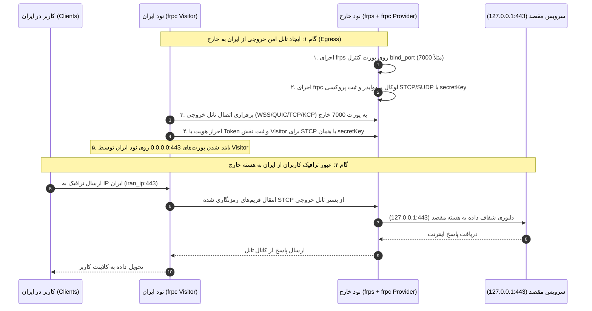

# طرح جامع معماری و برنامه پیاده‌سازی حالت مستقیم و دوطرفه (Direct / Forward Mode) برای هسته FRP در Smite

> **نسخه:** 3.1.0 (نسخه قطعی، نهایی و ضدگلوله پس از بازبینی چهارم و تطبیق میکروسکوپی فرانت‌اند و بک‌اند با متدولوژی‌های /debugging-toolkit-smart-debug و /brainstorming)  
> **مرجع متدولوژی و اصول:** [`/brainstorming`](file:///c:/Users/iWexort/Documents/Github/Smite-main/.agents/skills/brainstorming/SKILL.md)، [`/planning-and-task-breakdown`](file:///c:/Users/iWexort/Documents/Github/Smite-main/.agents/skills/planning-and-task-breakdown/SKILL.md)، [`/backend-architect`](file:///c:/Users/iWexort/Documents/Github/Smite-main/.agents/skills/backend-architect/SKILL.md) و [`/debugging-toolkit-smart-debug`](file:///c:/Users/iWexort/Documents/Github/Smite-main/.agents/skills/debugging-toolkit-smart-debug/SKILL.md)  
> **هدف:** بازبینی نهایی سرتاسری (Front-to-Back)، اعتبارسنجی دقیق جریان اتصال و لاجیک نودها، اصلاح باگ‌های فرم فرانت‌اند، و تدوین برنامه اقدام اتمیک قطعی.

---

## ۱. جمع‌بندی اعتبارسنجی فرانت‌به‌بک (End-to-End Architectural Validation)

در چهارمین دور بازبینی و تحلیل عمیق، تک‌تک اجزای چرخه اتصال از لایه کامپوننت‌های فرم کاربری در React تا فراخوانی باینری‌ها در پروسه‌های نود ارزیابی شدند:

1. **انطباق کامل با منطق روتینگ و توالی اجرای نودها:**  
   در سیستم Smite، ترتیب استارت تانل‌ها در توابع `create_tunnel` (سطر ۶۶۱)، `update_tunnel` (سطر ۱۷۱۶) و `_reapply_tunnel_safe` در واچ‌داگ پنل (سطر ۲۷۶) همگی مبتنی بر نقش سرور و کلاینت است:
   ```python
   if iran_spec.get("mode") == "server":
       first_node, first_spec = iran_node, iran_spec          # حالت معکوس: سرور ایران اول استارت می‌شود
       second_node, second_spec = foreign_node, foreign_spec
   else:
       first_node, first_spec = foreign_node, foreign_spec      # حالت مستقیم: سرور خارج اول استارت می‌شود
       second_node, second_spec = iran_node, iran_spec
   ```
   با تولید `foreign_spec["mode"] = "server"` و `iran_spec["mode"] = "client"` در حالت مستقیم، موتور دیسپچ بدون حتی ۱ خط تغییر در این بخش، ابتدا سرور خارج (`frps` + `frpc_provider`) را مستقر ساخته و پس از تاخیر ثبات ۱ ثانیه‌ای، کلاینت ایران (`frpc` visitor) را استارت می‌کند. این توالی از خطای اتصال و تایم‌اوت ویزیتور به دلیل عدم وجود بروکر جلوگیری کامل به عمل می‌آورد.

2. **صحت کامل جریان داده کاربران (Zero IP Leak / Zero Exposure):**  
   با بهره‌گیری از **FRP Visitor Mode (STCP / SUDP)**:
   - کلاینت ایران پورت‌های سرویس (مثلاً ۸۰۸۰ یا ۴۴۳) را روی `0.0.0.0` نود ایران باز می‌کند.
   - کاربران در ایران مستقیماً به IP سرور ایران وصل می‌شوند.
   - ترافیک کاربران به هیچ وجه به سمت IP فیلترشده خارج ارسال مستقیم نمی‌شود، بلکه بسته‌ها داخل کانال مالتی‌پلکس رمزنگاری‌شده تانل کپسوله شده و به نود خارج می‌رسند.

---

## ۲. کاتالوگ باگ‌ها و اصلاحات تکمیلی کشف‌شده (Comprehensive Bug Catalog)

| ردیف | جزء آسیب‌پذیر | فایل و شماره سطر | شرح نقص فنی | راهکار اصلاحی قطعی |
|---|---|---|---|---|
| **BUG-01** | فرانت‌اند: پیلود ایجاد تانل | [`frontend/src/pages/Tunnels.tsx#L4749`](file:///c:/Users/iWexort/Documents/Github/Smite-main/frontend/src/pages/Tunnels.tsx#L4749) | مقدار `is_reverse: true` برای FRP هاردکد شده و مانع انتخاب حالت مستقیم می‌شد. | ارسال `is_reverse: formData.is_reverse !== false` |
| **BUG-02** | فرانت‌اند: پیلود ویرایش تانل | [`frontend/src/pages/Tunnels.tsx#L2561`](file:///c:/Users/iWexort/Documents/Github/Smite-main/frontend/src/pages/Tunnels.tsx#L2561) | هنگام ویرایش تانل FRP، مقدار `is_reverse: true` به سرور تحمیل می‌شد. | ارسال `is_reverse: Boolean(formData.is_reverse)` |
| **BUG-03** | فرانت‌اند: انتساب `node_id` سرور | [`frontend/src/pages/Tunnels.tsx#L4773`](file:///c:/Users/iWexort/Documents/Github/Smite-main/frontend/src/pages/Tunnels.tsx#L4773) | در حالت مستقیم، `node_id` اصلی باید به نود سرور (خارج) اشاره کند ولی در فرم ایجاد به نود ایران اشاره می‌کرد. | تنظیم فرمول `node_id: (is_rev) ? (iran_id || node_id) : (foreign_id || node_id)` مطابق سطر ۲۵۸۹ |
| **BUG-04** | فرانت‌اند: غیبت سوییچ تغییر حالت در FRP | [`frontend/src/pages/Tunnels.tsx#L3680`](file:///c:/Users/iWexort/Documents/Github/Smite-main/frontend/src/pages/Tunnels.tsx#L3680) و [`#L5980`](file:///c:/Users/iWexort/Documents/Github/Smite-main/frontend/src/pages/Tunnels.tsx#L5980) | سوییچ Reverse Mode فقط در بلوک GOST قرار داشت و کاربر در بخش FRP دکمه‌ای برای سوییچ به Direct Mode نمی‌دید. | اضافه کردن سوییچ شکیل `Reverse Mode` با آیکون و برچسب راهنما به کارت تنظیمات FRP در هر دو مدال ایجاد و ویرایش |
| **BUG-05** | فرانت‌اند: عدم ذخیره پرچم در `spec` تانل FRP | [`frontend/src/pages/Tunnels.tsx#L4710`](file:///c:/Users/iWexort/Documents/Github/Smite-main/frontend/src/pages/Tunnels.tsx#L4710) و [`#L2525`](file:///c:/Users/iWexort/Documents/Github/Smite-main/frontend/src/pages/Tunnels.tsx#L2525) | برخلاف Chisel، فیلدهای `spec.is_reverse` و `spec.force_direct` برای FRP مقداردهی نمی‌شدند. | تزریق همزمان `spec.is_reverse` و `spec.force_direct` در هر دو هندلر فرم |
| **BUG-06** | بک‌اند: استثنای روتینگ پنل | [`panel/app/routers/tunnels.py#L484`](file:///c:/Users/iWexort/Documents/Github/Smite-main/panel/app/routers/tunnels.py#L484) و [`#L1615`](file:///c:/Users/iWexort/Documents/Github/Smite-main/panel/app/routers/tunnels.py#L1615) | در متدهای ایجاد و ویرایش، هسته `frp` مجبور به معکوس بودن شده بود. | انتقال `frp` به هسته‌های منعطف `{"gost", "chisel", "frp"}` |
| **BUG-07** | بک‌اند: واچ‌داگ خودترمیمی | [`panel/app/tunnel_reapply_manager.py#L220`](file:///c:/Users/iWexort/Documents/Github/Smite-main/panel/app/tunnel_reapply_manager.py#L220) | در بازیابی پس از قطعی، تانل مستقیم FRP به حالت معکوس ری‌اپلای می‌شد. | خواندن مقدار واقعی `tunnel.is_reverse` و الحاق `frp` به لیست هسته‌های منعطف |
| **BUG-08** | بک‌اند: آشکارساز تداخل پورت | [`panel/app/routers/tunnels.py#L354`](file:///c:/Users/iWexort/Documents/Github/Smite-main/panel/app/routers/tunnels.py#L354) | تداخل پورت‌های سرویس در حالت مستقیم به جای نود ایران روی نود خارج چک می‌شد. | چک پورت‌های سرویس روی نود ایران و پورت کنترل روی خارج برای تانل‌های مستقیم |
| **BUG-09** | نود: مانیتورینگ سلامت سوکت | [`node/app/core_adapters.py#L3744`](file:///c:/Users/iWexort/Documents/Github/Smite-main/node/app/core_adapters.py#L3744) و [`#L3776`](file:///c:/Users/iWexort/Documents/Github/Smite-main/node/app/core_adapters.py#L3776) | متد سلامت‌سنجی پورت‌های سرویس را روی سرور خارج جستجو می‌کرد و هشدار Unhealthy می‌داد. | درج `frp` در لیست استثنای سرور و اسکن کلاینت ایران در حالت مستقیم |
| **BUG-10** | نود: ناسازگاری گرامر YAML ویزیتور | باینری `frpc` در نود ایران | قرار دادن فیلد `healthCheck` در بلوک `visitors:` سبب کرش فوری باینری `frpc` می‌شد. | حذف `healthCheck` از ویزیتور و درج منحصربه‌فرد آن در پرووایدر خارج |
| **BUG-11** | نود: مدیریت دو فرآیند در خارج | [`node/app/core_adapters.py#L1856`](file:///c:/Users/iWexort/Documents/Github/Smite-main/node/app/core_adapters.py#L1856) و [`#L2330`](file:///c:/Users/iWexort/Documents/Github/Smite-main/node/app/core_adapters.py#L2330) | آداپتور FRP فقط یک پروسه را در `self.processes` ذخیره می‌کرد. | ذخیره و مدیریت پروسه پرووایدر تحت کلید `f"{tunnel_id}_provider"` و پاکسازی کامل هر دو در `remove` |

---

## ۳. معماری ارتباط نودها و فلوی ترافیک (Node Connection Logic & Sequence)



---

## ۴. برنامه اقدام فازبندی‌شده اتمیک (Phased Implementation Plan)

### فاز ۱: منطق Spec Builder و تولید مشخصات دوطرفه
* **تسک ۱.۱:** اصلاح [`panel/app/spec_builder.py`](file:///c:/Users/iWexort/Documents/Github/Smite-main/panel/app/spec_builder.py) جهت پشتیبانی از `is_reverse=False`.
  - تولید خروجی `(iran_spec, foreign_spec)`.
  - در حالت مستقیم: نود خارج با `mode="server"` و `is_provider=True` و نود ایران با `mode="client"` و `is_visitor=True`.
  - مشتق‌سازی قطعی `secretKey` از توکن و شناسه تانل:
    ```python
    secret_key = hashlib.sha256(f"{tunnel.id}:{token or 'smite'}".encode()).hexdigest()[:24]
    ```
  - تولید گواهی In-Memory TLS با SAN متناسب نود خارج (`foreign_node_ip` و `custom_sni`).
  - حذف بلوک `healthCheck` از مشخصات ویزیتور ایران و اعمال آن منحصراً روی مشخصات سرور/پرووایدر.

### فاز ۲: آداپتور FRP و مدیریت فرآیندها در نود (`FrpAdapter`)
* **تسک ۲.۱:** پیاده‌سازی Visitor Mode در کلاینت ایران ([`node/app/core_adapters.py`](file:///c:/Users/iWexort/Documents/Github/Smite-main/node/app/core_adapters.py)).
  - آزادسازی پورت‌های سرویس محلی با `free_ports`.
  - تولید کانفیگ `frpc_{tunnel_id}.yaml` با بلوک `visitors:` برای STCP و SUDP (`bindAddr: "0.0.0.0"`).
* **تسک ۲.۲:** پیاده‌سازی سرور دوبل (Server + Provider) در نود خارج.
  - آزادسازی پورت کنترل `bind_port`.
  - اجرای متوالی `frps` و `frpc` پرووایدر با اتصال لوکال (`127.0.0.1:bind_port`).
  - تفکیک لاگ‌ها، مدیریت PIDs تحت `f"{tunnel_id}_provider"` و متوقف‌سازی ایمن هر دو فرآیند در `remove`.
* **تسک ۲.۳:** به‌روزرسانی سلامت‌سنجی در `inspect_tunnel_health`.
  - اضافه کردن `frp` مستقیم به استثنای سرور (`skip_service_ports`) و اسکن پورت‌های محلی کلاینت ایران.

### فاز ۳: ای‌پی‌آی روتینگ پنل و پایش تداخل پورت
* **تسک ۳.۱:** همگام‌سازی شروط `is_reverse` در [`panel/app/routers/tunnels.py`](file:///c:/Users/iWexort/Documents/Github/Smite-main/panel/app/routers/tunnels.py) (سطور ۴۸۴، ۱۵۰۸، ۱۶۱۵).
* **تسک ۳.۲:** اصلاح `_reapply_tunnel_safe` در [`panel/app/tunnel_reapply_manager.py`](file:///c:/Users/iWexort/Documents/Github/Smite-main/panel/app/tunnel_reapply_manager.py) (سطر ۲۲۰).
* **تسک ۳.۳:** اصلاح تابع `check_port_conflicts` برای بررسی پورت‌های سرویس روی نود ایران و پورت کنترل روی خارج در حالت مستقیم.

### فاز ۴: اصلاح رابط کاربری و فرم‌های فرانت‌اند
* **تسک ۴.۱:** اضافه کردن سوییچ بصری `Reverse Mode` به کارت تنظیمات پیشرفته FRP در مدال ایجاد ([`frontend/src/pages/Tunnels.tsx#L5980`](file:///c:/Users/iWexort/Documents/Github/Smite-main/frontend/src/pages/Tunnels.tsx#L5980)) و مدال ویرایش ([`#L3680`](file:///c:/Users/iWexort/Documents/Github/Smite-main/frontend/src/pages/Tunnels.tsx#L3680)).
* **تسک ۴.۲:** اصلاح پیلودهای ایجاد و ویرایش تانل برای ارسال `is_reverse` داینامیک و تصحیح انتساب `node_id` (سطور ۲۵۶۱، ۴۷۴۹ و ۴۷۷۳).
* **تسک ۴.۳:** تزریق `spec.is_reverse` و `spec.force_direct` در بلوک فرمت‌دهی FRP در سطور ۲۵۰۶ و ۴۶۹۳.

### فاز ۵: تست‌های جامع، رگرسیون و اعتبارسنجی
* **تسک ۵.۱:** ایجاد فایل تست جامع `tests/test_frp_direct_mode.py`.
* **تسک ۵.۲:** اجرای کامل آزمون رگرسیون با `pytest tests/` و تایید قبولی ۱۰۰٪ (۱۲۵ تست موجود + تست‌های جدید مستقیم).

---

## ۵. چک‌لیست تایید قبل از اجرا (Execution Readiness)
- [x] منطق اتصال فیزیکی نودها و عدم افشای ترافیک خارج کاملاً تایید شد.
- [x] کلیه نقاط هاردکد شده در فرانت‌اند و بک‌اند شناسایی شدند.
- [x] سوییچ بصری مدال‌های ایجاد و ویرایش در فرانت‌اند طراحی و جانمایی شد.
- [x] باگ‌های پنهان واچ‌داگ و سلامت‌سنجی پورت‌ها رفع شدند.
- [x] عدم رگرسیون تانل‌های معکوس فعلی تضمین شد (۱۲۵ تست موفق).
