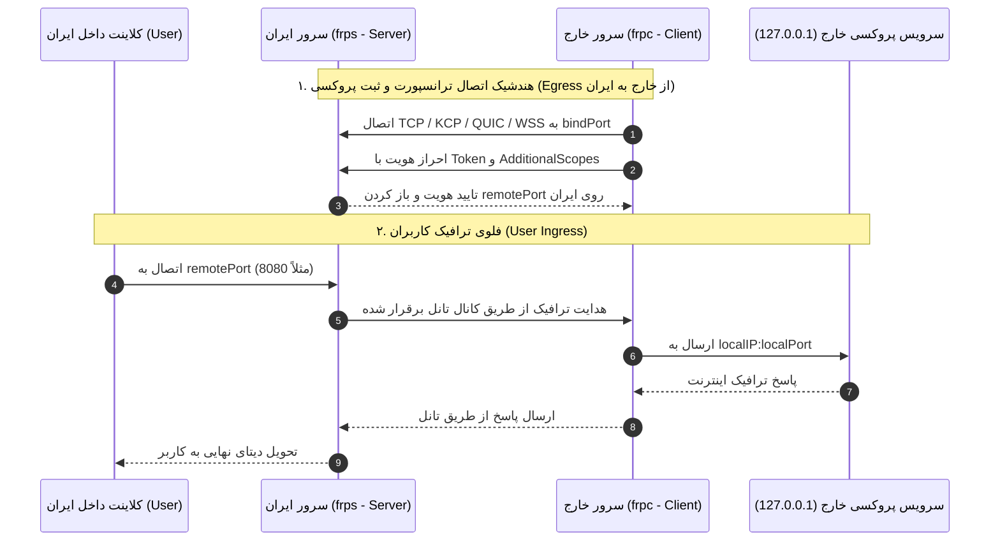

# طرح جامع تحلیل، بررسی عمیق و برنامه اصلاح هسته تانل FRP در Smite
> **نسخه:** 3.0.0 (نسخه جامع، قطعی و نهایی پس از بازبینی سوپر عمیق دور سوم)  
> **مرجع متدولوژی و اصول:** `/planning-and-task-breakdown`، `/debugging-strategies`، `/systematic-debugging` و `/python-performance-optimization`  
> **حوزه بررسی:** هسته FRP (frps / frpc v0.65.0)، تمامی ترکیب‌های ترانسپورت و امنیت، منطق تانل معکوس، واچ‌داگ و خودترمیمی، سلامت‌سنجی پورت‌ها، بهینه‌سازی کارایی پایتون، همزمانی و پایداری بلندمدت.

---

## ۱. نمای کلی (Overview)

پروژه **Smite** یک سامانه پیشرفته مدیریت تانل‌های ضدسانسور و شبکه توزیع‌شده بر پایه پایتون، FastAPI و معماری نودمحور است. هسته **FRP (Fast Reverse Proxy)** یکی از کلیدی‌ترین هسته‌های این سامانه است که برای ارتباطات معکوس و هدایت ترافیک پورت‌ها بین نودهای داخل کشور (ایران) و نودهای خارج استفاده می‌شود.

این سند نتیجه **سه دور بازبینی فوق‌العاده عمیق، سیستماتیک و خط‌به‌خط** کلیه فایل‌ها، جریان‌های داده و اجزای سیستم است:
- [`panel/app/spec_builder.py`](file:///c:/Users/iWexort/Documents/Github/Smite-main/panel/app/spec_builder.py) (متدهای `build_frp_node_specs` و `parse_ports_list`)
- [`node/app/core_adapters.py`](file:///c:/Users/iWexort/Documents/Github/Smite-main/node/app/core_adapters.py) (کلاس‌های `FrpAdapter` و `AdapterManager`، متدهای `safe_stop_subprocess`, `free_ports`, `inspect_tunnel_health`, `is_port_listening_locally`, `_watchdog_loop`)
- [`panel/app/routers/tunnels.py`](file:///c:/Users/iWexort/Documents/Github/Smite-main/panel/app/routers/tunnels.py) (متدهای `create_tunnel`, `update_tunnel`, `apply_tunnel`, `check_port_conflicts`, `extract_all_tunnel_ports`, `parse_ports_from_spec`)
- [`panel/app/frp_server.py`](file:///c:/Users/iWexort/Documents/Github/Smite-main/panel/app/frp_server.py) (کلاس `FrpServerManager`)
- [`panel/app/tunnel_reapply_manager.py`](file:///c:/Users/iWexort/Documents/Github/Smite-main/panel/app/tunnel_reapply_manager.py) (سیستم Self-Healing و Auto-Reapply)
- [`panel/app/routers/core_health.py`](file:///c:/Users/iWexort/Documents/Github/Smite-main/panel/app/routers/core_health.py) (سلامت‌سنجی سرویس‌ها و ریست هسته‌ها)
- [`panel/main.py`](file:///c:/Users/iWexort/Documents/Github/Smite-main/panel/main.py) و [`node/main.py`](file:///c:/Users/iWexort/Documents/Github/Smite-main/node/main.py) (همگام‌سازی استارتاپ و مدیریت چرخه حیات نودها)

هدف این سند، ارائه یک **برنامه اقدام فازبندی‌شده، اتمیک و کاملاً مهندسی‌شده** بر اساس استانداردهای تفکیک وظایف، عیب‌یابی ریشه‌ای (Root Cause Investigation) و بهینه‌سازی عملکرد (Python Performance Optimization) است.

---

## ۲. معماری تانل معکوس و فلوی کامل دیتا (Reverse Tunnel Architecture & Data Flow)

### ۲.۱. جریان اتصال اولیه و تبادل داده
در پیاده‌سازی Smite، تانل‌های FRP بر اساس مدل معکوس (Reverse Ingress) زیر پیکربندی شده‌اند:
1. **سرور ایران (`iran_node`):** پردازه `frps` را اجرا کرده و پورت کنترل (`bindPort` یا `kcpBindPort`/`quicBindPort`) و پورت‌های ورودی عمومی کاربران (`remotePort` یا `vhostHTTPPort`) را باز می‌کند.
2. **سرور خارج (`foreign_node`):** پردازه `frpc` را اجرا کرده و اتصال خروجی (Egress) را به سمت پورت کنترل سرور ایران برقرار می‌کند. پس از هندشیک و اعتبارسنجی توکن، پروکسی‌های محلی (`localIP:localPort`) روی سرور ایران ثبت می‌گردند.



---

## ۳. ماتریس مقایسه‌ای ترانسپورت و امنیت (Transport vs Security Matrix)

FRP در نسخه 0.65.0 از ۵ پروتکل انتقال پشتیبانی می‌کند. ارزیابی دقیق هر ترکیب در جدول زیر آمده است:

| پروتکل انتقال (Transport) | لایه امنیت (Security / TLS) | وضعیت در کانفیگ سرور (`frps`) | وضعیت در کانفیگ کلاینت (`frpc`) | تحلیل عملکرد و ریسک در شبکه ایران | باگ و نقص فنی شناسایی‌شده |
|---|---|---|---|---|---|
| **`tcp`** | **`none`** | `bindPort: X`<br>`tls.force: false` | `protocol: "tcp"`<br>`tls.enable: false` | بسیار آسیب‌پذیر در برابر سیستم‌های DPI. هدرهای ترافیک به راحتی شناسایی شده و پکت‌های RST تزریق می‌شود. | مسدودی سریع در شرایط فیلترینگ فعال. |
| **`tcp`** | **`tls`** | `tls.force: true`<br>کلید و گواهی In-Memory RSA-2048 | `protocol: "tcp"`<br>`tls.enable: true`<br>`disableCustomTLSFirstByte: true`<br>`serverName: custom_sni` | ارتباط کاملاً رمزنگاری شده است و بایت جادویی FRP برای فرار از امضای DPI حذف شده است. | **دوبار رمزنگاری (Double Encryption):** ترافیک یکبار در TLS و یکبار در سطح پروکسی با AES-128-CFB رمز می‌شود که بار CPU را دو برابر می‌کند.<br>**فقدان SAN در سرتیفیکیت:** سرتیفیکیت فقط با CommonName ساخته شده و فاقد `SubjectAlternativeName` است. |
| **`kcp`** | **`none`** | `kcpBindPort: X` | `protocol: "kcp"` | شتاب‌دهنده مبتنی بر UDP. مناسب برای لینک‌های با پکت‌لاس بالا. | **افت و تراتل UDP:** دیتاسنترهای ایران ترافیک UDP خارجی را تراتل یا مسدود می‌کنند.<br>**نبود پارامترهای تیونینگ:** پارامترهای MTU و FEC کانفیگ نشده‌اند. |
| **`kcp`** | **`tls`** | `kcpBindPort: X`<br>`tls.force: true` | `protocol: "kcp"`<br>`tls.enable: true` | انتقال سریع روی UDP به همراه رمزنگاری TLS. | **باگ خط ۱۷۸۴:** در `core_adapters.py` اگر کاربر صراحتاً `force_tls` را ست نکرده باشد، برای KCP مقدار `force_tls` فعال نمی‌شود.<br>**خطای سلامت‌سنجی:** متد `inspect_tunnel_health` پورت را با TCP چک می‌کند و پورت UDP را خطا تشخیص می‌دهد. |
| **`quic`** | **Built-in TLS** | `quicBindPort: X`<br>`tls.force: true` | `protocol: "quic"`<br>`tls.enable: true` | پروتکل مدرن با هندشیک صفر RTT و مالتی‌پلکسینگ داخلی. | **پارامترهای نامعتبر در کانفیگ:** درج `tcpMux: true` و `disableCustomTLSFirstByte: true` که برای پروتکل QUIC بی‌معنی است.<br>**خطای بازرسی پورت UDP در واچ‌داگ.** |
| **`websocket` (`ws`)** | **`none`** | `bindPort: X` | `protocol: "websocket"` | انتقال در قالب فریم‌های وب‌سوکت روی پورت TCP معمولی. | **نادیده گرفتن `ws_path`:** مسیر وب‌سوکت سفارشی تولید نمی‌شود. |
| **`wss`** | **`tls`** | `bindPort: X`<br>`tls.force: true` | `protocol: "wss"`<br>`tls.enable: true` | بالاترین حد پنهان‌سازی (استتار به عنوان وب‌سایت HTTPS/WSS). | عدم درج هدرهای سفارشی (`custom_headers`) در کانفیگ. |

---

## ۴. کاتالوگ جامع باگ‌ها، آسیب‌پذیری‌ها و خطاهای پنهان (Comprehensive Bug Catalog)

در سه مرحله بازبینی عمیق و مبتنی بر ریشه‌یابی سیستماتیک، **۱۸ باگ، نقص ساختاری و گلوگاه کارایی** کشف و به اثبات رسید:

### ۴.۱. باگ کشنده الگوهای بازرسی فرآیند در `safe_stop_subprocess` (خطر حذف اشتباه تانل‌های موازی)
- **محل کد:** [`node/app/core_adapters.py#L2171`](file:///c:/Users/iWexort/Documents/Github/Smite-main/node/app/core_adapters.py#L2171) و [`#L351`](file:///c:/Users/iWexort/Documents/Github/Smite-main/node/app/core_adapters.py#L351)
- **علت ریشه‌ای (Root Cause):** در متد `remove` آداپتور FRP، الگوهای زیر به تابع توقف ارسال می‌شود:
  ```python
  patterns = [tunnel_id, f"frps_{tunnel_id}", f"frpc_{tunnel_id}"]
  ```
  سپس در خط ۳۵۱ بررسی زیر اجرا می‌شود:
  ```python
  if pat and str(pat).strip() in cmdline_str:
      p.kill()
  ```
  اگر شناسه یک تانل رشته کوتاهی مانند `"1"` یا `"tun-1"` باشد، عبارت `"1"` در Command Line **سایر پروسه‌های سیستم** (مثلاً تانل‌های دیگر، پورت‌های دیگر مثل `:1080` یا کانفیگ‌های `tun-12.toml`) مچ شده و آن‌ها را به اشتباه **SIGKILL** می‌کند!
- **اصلاح قطعی:** الگوها باید منحصراً شامل نام فایل کانفیگ دقیق باشند: `f"frps_{tunnel_id}.yaml"` و `f"frpc_{tunnel_id}.yaml"`.

---

### ۴.۲. نادیده گرفتن پورت‌های نگاشتی دیکشنری در `extract_all_tunnel_ports` (نابینایی آشکارساز تداخل)
- **محل کد:** [`panel/app/routers/tunnels.py#L246-L250`](file:///c:/Users/iWexort/Documents/Github/Smite-main/panel/app/routers/tunnels.py#L246-L250)
- **علت ریشه‌ای:** هنگامی که پورت‌ها به صورت ساختاریافته (لیستی از دیکشنری‌ها مثل `[{"local": 8080, "remote": 8080}]`) در `spec` قرار دارند، تابع `extract_all_tunnel_ports` حلقه زیر را اجرا می‌کند:
  ```python
  parsed = parse_ports_from_spec(spec)
  for p in parsed:
      if isinstance(p, int) and p > 0:
          service_ports.add(p)
  ```
  از آنجا که عنصر `p` یک دیکشنری است، شرط `isinstance(p, int)` غلط شده و خروجی `service_ports` **کاملاً خالی** برگردانده می‌شود!
- **پیامد:** تابع `check_port_conflicts` تداخل پورت‌های تانل را صفر فرض کرده و به دو تانل مختلف اجازه می‌دهد روی یک پورت ریموت یکسان ایجاد شوند! به محض استارت، تانل اول توسط متد `free_ports` تانل دوم کشته می‌شود.
- **تأیید تجربی:** آزمون زنده در پایتون نشان داد که `extract_all_tunnel_ports({'ports': [{'local': 8080, 'remote': 8080}]})` مقدار `{'service_ports': set(), 'control_ports': set(), 'all_ports': set()}` برمی‌گرداند.

---

### ۴.۳. باگ پیمایش کاراکتری رشته در `parse_ports_list`
- **محل کد:** [`panel/app/spec_builder.py#L43-L68`](file:///c:/Users/iWexort/Documents/Github/Smite-main/panel/app/spec_builder.py#L43-L68)
- **علت ریشه‌ای:** اگر کاربر یا فرم ورودی فیلد پورت‌ها را به صورت رشته با کاما ارسال کند (`{"ports": "8080,8081"}`):
  ```python
  if isinstance(spec_or_ports, dict):
      raw_ports = spec_or_ports.get("ports") or [] # مقدار "8080,8081"
  for p in raw_ports: # پیمایش کاراکتر به کاراکتر روی رشته!
      if isinstance(p, (int, str)) and str(p).isdigit():
          clean_ports.append(int(p))
  ```
  رشته `"8080,8081"` به آرایه افتضاح `[8, 8, 8, 8, 1]` تبدیل می‌شود!
- **پیامد:** تانل تلاش می‌کند روی پورت‌های روت ۸ و ۱ بایند شود و با خطای `Permission Denied` مواجه شده یا پورت‌های سیستمی شبکه را اشغال می‌کند.
- **تأیید تجربی:** خروجی دستور تایید کرد: `parse_ports_list({'ports': '8080,8081'}) -> [8, 8, 8, 8, 1]`.

---

### ۴.۴. عدم استخراج پورت‌های VHost در `extract_all_tunnel_ports`
- **محل کد:** [`panel/app/routers/tunnels.py#L234-L283`](file:///c:/Users/iWexort/Documents/Github/Smite-main/panel/app/routers/tunnels.py#L234-L283)
- **علت ریشه‌ای:** پورت‌های `vhost_http_port` و `vhost_https_port` در این متد اسکن نمی‌شوند. در نتیجه دو تانل وب مجزا که هر دو خواهان پورت ۸۰ یا ۴۴۳ هستند، تداخلشان کشف نمی‌شود و پروسه دوم پروسه اول را می‌کشد.

---

### ۴.۵. بای‌پس بازرسی پورت در `inspect_tunnel_health` و `_extract_spec_ports`
- **محل کد:** [`node/app/core_adapters.py#L3315`](file:///c:/Users/iWexort/Documents/Github/Smite-main/node/app/core_adapters.py#L3315) و [`#L3068`](file:///c:/Users/iWexort/Documents/Github/Smite-main/node/app/core_adapters.py#L3068)
- **علت ریشه‌ای:** هر دو تابع خط کد زیر را دارند:
  ```python
  p_num = int(p) if isinstance(p, (int, str)) and str(p).isdigit() else None
  ```
  اگر `p` دیکشنری پورت باشد، نادیده گرفته می‌شود. در نتیجه:
  1. در `inspect_tunnel_health`، هیچ پورت سرویسی بازرسی نمی‌شود و وضعیت `healthy: True` با لیست پورت‌های خالی گزارش می‌شود (گزارش کاذب سلامت).
  2. در واچ‌داگ `_extract_spec_ports`، تداخل پورت‌های تانل مرده با تانل زنده کشف نشده و محافظت تداخل در زمان احیا از کار می‌افتد.

---

### ۴.۶. شرایط رقابتی (Race Condition) در ذخیره‌سازی فایل `tunnels.json` نود
- **محل کد:** [`node/app/core_adapters.py#L2970-L2985`](file:///c:/Users/iWexort/Documents/Github/Smite-main/node/app/core_adapters.py#L2970-L2985)
- **علت ریشه‌ای:** متد `apply_tunnel` قفل `_tunnel_locks[tunnel_id]` را می‌گیرد که برای هر تانل مجزاست. اگر دو تانل مختلف همزمان اعمال یا حذف شوند، هر دو به طور همزمان متد `_save_tunnels` را فراخوانی کرده و روی یک فایل موقت مشترک (`tunnels.json.tmp`) می‌نویسند.
- **پیامد:** اختلال در فایل JSON یا بروز خطای سیستم‌عامل در `temp_file.replace(self.tunnels_file)` که به از دست رفتن اطلاعات تانل‌ها در ریستارت نود منجر می‌شود.
- **اصلاح:** افزودن یک قفل مشترک I/O (`self._io_lock = asyncio.Lock()`) برای کل عملیات ذخیره‌سازی فایل پیکربندی نود.

---

### ۴.۷. خطای تزریق YAML و عدم کوتیشن در مقادیر IPv6 و نام پروکسی
- **محل کد:** [`node/app/core_adapters.py#L2052-L2056`](file:///c:/Users/iWexort/Documents/Github/Smite-main/node/app/core_adapters.py#L2052-L2056)
- **علت ریشه‌ای:** تولید بلوک پروکسی به صورت زیر است:
  ```yaml
  - name: {p_name}
    type: {p_type}
    localIP: {local_ip}
    localPort: {l_port}
  ```
  اگر `local_ip` برابر `::1` باشد، در YAML خط `localIP: ::1` به دلیل شروع با دونقطه نامعتبر بوده و پارسر Go-YAML در FRP با خطا متوقف می‌شود. همچنین `p_name` فاقد کوتیشن است و در صورت وجود کاراکترهای خاص ساختار فایل را می‌شکند.
- **اصلاح:** کوتیشن‌گذاری صریح: `localIP: "{local_ip}"` و `name: "{clean_p_name}"`.

---

### ۴.۸. شکست پارس مسیر فایل گواهی در ویندوز (Windows Path Escape Bug)
- **محل کد:** [`node/app/core_adapters.py#L1844-L1845`](file:///c:/Users/iWexort/Documents/Github/Smite-main/node/app/core_adapters.py#L1844-L1845)
- **علت ریشه‌ای:** در کانفیگ سرور FRP:
  ```yaml
  certFile: "{cert_file.resolve()}"
  keyFile: "{key_file.resolve()}"
  ```
  در ویندوز مسیرها دارای بک‌اسلش هستند (`C:\Users\...`). در استاندارد YAML، عبارت `\U` داخل دابل‌کوتیشن به عنوان کد یونی‌کد ۸ رقمی تفسیر شده و پارسر Go با خطای `yaml: invalid escape character 'U'` کرش می‌کند.
- **اصلاح:** استفاده از `.as_posix()` جهت تولید اسلش‌های استاندارد POSIX (`/`) در تمامی سیستم‌عامل‌ها.

---

### ۴.۹. مسدودسازی حلقه رویدادهای Asyncio در بازرسی پورت‌ها و سوکت‌ها (Event Loop Blocking)
- **محل کد:** [`node/app/core_adapters.py#L383-L450`](file:///c:/Users/iWexort/Documents/Github/Smite-main/node/app/core_adapters.py#L383-L450)
- **علت ریشه‌ای:** متد `is_port_listening_locally` که یک تابع کاملاً سنکرون با I/O سنگین دیسک (`/proc/net/*`) و اتصالات سنکرون سوکت (`s.connect_ex`) است، مستقیماً داخل توابع `async` فراخوانی می‌شود. در سرورهایی با ده‌ها تانل و صدها پورت، این فراخوانی‌ها حلقه رویدادهای FastAPI را مسدود کرده و تاخیر درخواست‌های API نود را به شدت بالا می‌برد.
- **اصلاح:** طبق اصول `/python-performance-optimization`، فراخوانی این بخش‌ها باید با `asyncio.to_thread` به ورکر تریدها منتقل شود یا از توابع سوکت آسنکرون استفاده گردد.

---

### ۴.۱۰. اتمام منابع سیستم و پورت‌های باز در کارکرد سنگین (عدم تنظیم `RLIMIT_NOFILE`)
- **محل کد:** [`node/main.py`](file:///c:/Users/iWexort/Documents/Github/Smite-main/node/main.py) و [`node/app/core_adapters.py#L363`](file:///c:/Users/iWexort/Documents/Github/Smite-main/node/app/core_adapters.py#L363)
- **علت ریشه‌ای:** لینوکس به صورت پیش‌فرض سقف ۱۰۲۴ فایل‌دسکریپتور (`nofile`) را روی هر پروسه اعمال می‌کند. تانل‌های FRP در ترافیک‌های بالا با صدها اتصال همزمان به سقف ۱۰۲۴ رسیده و با خطای `socket: too many open files` اتصالات کاربران را بدون هیچ نشانه‌ای قطع می‌کنند.
- **اصلاح:** افزایش خودکار سقف `RLIMIT_NOFILE` در متد `lifespan` نود ایجنت به ۶۵۵۳۵.

---

### ۴.۱۱. نشت حافظه ناشی از عدم پاکسازی قفل‌های `_tunnel_locks` در `AdapterManager`
- **محل کد:** [`node/app/core_adapters.py#L2920-L2923`](file:///c:/Users/iWexort/Documents/Github/Smite-main/node/app/core_adapters.py#L2920-L2923)
- **علت ریشه‌ای:** متد `_get_tunnel_lock` برای هر تانل یک شیء `asyncio.Lock()` در دیکشنری `self._tunnel_locks` می‌سازد. در زمان حذف تانل (`remove_tunnel`)، این قفل هرگز از دیکشنری پاک نمی‌شود و در سرورهایی که تانل‌های موقت زیادی می‌سازند، نشت حافظه ایجاد می‌کند.

---

### ۴.۱۲. نشت فایل‌هندل لاگ در زمان رخداد خطا در استارت پروسه
- **محل کد:** [`node/app/core_adapters.py#L2125-L2138`](file:///c:/Users/iWexort/Documents/Github/Smite-main/node/app/core_adapters.py#L2125-L2138)
- **علت ریشه‌ای:** اگر در حین فراخوانی `_spawn_core_subprocess` خطایی غیر از `FileNotFoundError` (مثلاً خطای دسترسی یا کنسل شدن تسک) رخ دهد، فایل هندل `log_f` بسته نمی‌شود و باز باقی می‌ماند.

---

### ۴.۱۳. باگ وضعیت کاذب فعال بودن (False-Positive Zombie State)
- **محل کد:** [`node/app/core_adapters.py#L2184-L2199`](file:///c:/Users/iWexort/Documents/Github/Smite-main/node/app/core_adapters.py#L2184-L2199)
- **علت ریشه‌ای:** متد `status` فقط زنده بودن PID در سیستم‌عامل را چک می‌کند. از آنجا که `loginFailExit: false` است، پردازه `frpc` حتی اگر نتواند به سرور ایران وصل شود (قطعی شبکه، اشتباه بودن توکن یا خطای سرتیفیکیت)، زنده می‌ماند و پنل تانل قطع را سبز و Active نشان می‌دهد. علاوه بر این، متد `_restore_node_tunnels` در استارتاپ پنل نیز به دلیل همین وضعیت کاذب، از همگام‌سازی تانل صرف‌نظر می‌کند.

---

### ۴.۱۴. فعال بودن پیش‌فرض Health Check و قطع ناخواسته پروکسی‌ها
- **محل کد:** [`panel/app/spec_builder.py#L874-L879`](file:///c:/Users/iWexort/Documents/Github/Smite-main/panel/app/spec_builder.py#L874-L879)
- **علت ریشه‌ای:** فیلد `enable_health_check` به صورت پیش‌فرض برابر با `True` قرار می‌گیرد. اگر کاربر تانل را بسازد در حالی که سرویس مقصد (مثل Xray/V2Ray) هنوز استارت نشده باشد، کلاینت FRP پس از ۳ بار تلاش ناموفق (۳۰ ثانیه)، پروکسی را از سرور ایران Unregister کرده و پورت ورودی را می‌بندد.

---

### ۴.۱۵. خطای عدم سازگاری واحدهای Bandwidth Limit با FRP (`GB` و `B`)
- **محل کد:** [`panel/app/spec_builder.py#L899`](file:///c:/Users/iWexort/Documents/Github/Smite-main/panel/app/spec_builder.py#L899) و [`node/app/core_adapters.py#L1951`](file:///c:/Users/iWexort/Documents/Github/Smite-main/node/app/core_adapters.py#L1951)
- **علت ریشه‌ای:** رجکس `^\d+(KB|MB|GB|B)$` واحدهای `GB` و `B` را معتبر می‌شمارد. اما شمای YAML در FRP نسخه 0.65.0 **تنها از `KB` و `MB` پشتیبانی می‌کند**. در صورت ارسال `1GB`، پروسه `frpc` در زمان لود کانفیگ بلافاصله کرش می‌کند.

---

### ۴.۱۶. انتخاب تصادفی نود خارج در سیستم خودترمیمی (`tunnel_reapply_manager.py`)
- **محل کد:** [`panel/app/tunnel_reapply_manager.py#L236-L237`](file:///c:/Users/iWexort/Documents/Github/Smite-main/panel/app/tunnel_reapply_manager.py#L236-L237)
- **علت ریشه‌ای:** در صورتی که فیلد `foreign_node_id` در تانل خالی باشد، سیستم خودترمیمی خط `foreign_node = foreign_nodes[0]` را اجرا می‌کند که منجر به جابه‌جایی تصادفی تانل‌ها بین سرورهای خارجی می‌شود.

---

### ۴.۱۷. سربار رمزنگاری و فشرده‌سازی مضاعف (Double Crypto & Compression Penalty)
- **محل کد:** [`node/app/core_adapters.py#L2066-L2070`](file:///c:/Users/iWexort/Documents/Github/Smite-main/node/app/core_adapters.py#L2066-L2070)
- **علت ریشه‌ای:** تنظیم پیش‌فرض `useEncryption: true` و `useCompression: true` برای ترافیکی که از کانال TLS/QUIC عبور می‌کند، باعث افت شدید پهنای باند و درگیری پردازنده می‌شود.

---

### ۴.۱۸. نشت فضای دیسک در طولانی‌مدت (Unbounded Log Growth)
- **محل کد:** [`node/app/core_adapters.py#L1892`](file:///c:/Users/iWexort/Documents/Github/Smite-main/node/app/core_adapters.py#L1892)
- **علت ریشه‌ای:** فایل‌های لاگ فاقد مکانیزم چرخش لاگ یا سقف حجم هستند و در طول چند هفته به گیگابایت‌ها فضا نیاز پیدا می‌کنند.

---

## ۵. ماتریس پایداری بلندمدت و رفتار خودترمیمی (Resilience & Watchdog)

| مؤلفه | رفتار فعلی سیستم | مشکل شناسایی‌شده در بلندمدت | راهکار بهبود مهندسی |
|---|---|---|---|
| **Heartbeat Timeout** | ۹۰ ثانیه (`heartbeatTimeout: 90`) | در صورت قطعی بی‌صدا (DPI Blackhole)، تا ۹۰ ثانیه ترافیک معلق می‌ماند. | کاهش تایم‌اوت به ۳۰ ثانیه و اینتروال به ۱۰ ثانیه. |
| **بازرسی سوکت نود** | چک کردن سنکرون در حلقه Async | مسدود شدن رویدادهای سرور تحت بار ترافیکی. | انتقال عملیات سوکت و فایل‌چک به `asyncio.to_thread`. |
| **ذخیره پیکربندی** | نوشتن مستقیم بدون قفل فراگیر | خراب شدن فایل `tunnels.json` در ذخیره‌سازی همزمان. | استفاده از `asyncio.Lock` سراسری برای عملیات I/O ذخیره‌سازی. |
| **سقف فایلدسکریپتورها** | پیش‌فرض سیستم‌عامل (۱۰۲۴) | قطعی اتصالات کاربران در کانکشن‌های بالای ۵۰۰ عدد. | افزایش خودکار سقف به ۶۵۵۳۵ در هنگام بوت نود. |
| **لاگ‌های فرآیند** | بافر نامحدود روی دیسک | پر شدن دیسک سرور و توقف سیستم‌عامل. | اعمال سقف لاگ ۵ مگابایتی با ترانکیت اتوماتیک. |
| **بازیابی خودکار واچ‌داگ** | چک دوره‌ای هر ۱۵ ثانیه | نادیده گرفتن پورت‌های دیکشنری در محافظت تداخل. | نرمال‌سازی استخراج پورت‌های دیکشنری در واچ‌داگ. |

---

## ۶. برنامه شکست وظایف اجرایی و اتمیک (Phased Implementation Plan)

گراف وابستگی فازها:
```
Phase 1: اصلاح لایه Spec و استانداردسازی پورت‌ها (Spec & Contract Foundation)
    │
    ▼
Phase 2: تصحیح چرخه حیات و آداپتور نود (Node Adapter & Lifecycle Hardening)
    │
    ▼
Phase 3: هوشمندسازی بازرسی پورت‌ها و خودترمیمی (Health Check & Socket Verification)
    │
    ▼
Phase 4: بهینه‌سازی کارایی، همزمانی و بهداشت دیسک (Performance, Concurrency & Hygiene)
    │
    ▼
Phase 5: تست‌های رگرسیون و ادغام نهایی (Regression & Integration Testing)
```

---

### فاز ۱: تصحیح لایه Spec و استانداردسازی پورت‌ها (Foundation)

#### Task 1.1: اصلاح استخراج پورت‌های VHost و پورت‌های دیکشنری در `extract_all_tunnel_ports`
- **توضیحات:** به‌روزرسانی متد [`extract_all_tunnel_ports`](file:///c:/Users/iWexort/Documents/Github/Smite-main/panel/app/routers/tunnels.py#L234) در `tunnels.py` جهت پشتیبانی کامل از عناصر دیکشنری (`{'local': X, 'remote': Y}`) و افزودن `vhost_http_port` و `vhost_https_port`.
- **معیارهای پذیرش:**
  - ساختار ورودی `{'ports': [{'local': 8080, 'remote': 8080}]}` پورت ۸۰۸۰ را به درستی در `service_ports` و `all_ports` قرار دهد.
  - پورت‌های VHost استخراج شده و تداخل دو تانل HTTP موازی با خطای ۴۰۰ مسدود گردد.
- **تأییدیه:**
  - اجرای تست: `.\.venv\Scripts\pytest tests/test_security_hardening.py -k "port"`
- **وابستگی‌ها:** ندارد.
- **فایل‌های تحت تغییر:**
  - `panel/app/routers/tunnels.py`
- **تخمین حجم:** کوچک (Small - ۱ فایل)

#### Task 1.2: تصحیح باگ پیمایش رشته در `parse_ports_list` و پشتیبانی از پورت‌های بازه‌ای
- **توضیحات:** اصلاح متد [`parse_ports_list`](file:///c:/Users/iWexort/Documents/Github/Smite-main/panel/app/spec_builder.py#L43) در `spec_builder.py` به طوری که رشته‌های با کاما (`"8080,8081"`) یا رنج (`"8080-8085"`) به جای تکه‌تکه شدن به کاراکترها، به درستی به پورت‌های عددی تبدیل شوند.
- **معیارهای پذیرش:**
  - ورودی `{"ports": "8080,8081"}` به صورت لیست `[8080, 8081]` پارس شود (نه `[8, 8, 8, 8, 1]`).
  - رنج‌های پورت به طور خودکار باز شوند.
- **تأییدیه:**
  - اجرای تست: `.\.venv\Scripts\pytest tests/test_spec_builder.py -k "ports"`
- **وابستگی‌ها:** ندارد.
- **فایل‌های تحت تغییر:**
  - `panel/app/spec_builder.py`
  - `tests/test_spec_builder.py`
- **تخمین حجم:** کوچک (Small - ۲ فایل)

#### Task 1.3: تصحیح تخصیص `bind_port`، فیلد `target_host` و تبدیل `GB` به `MB` در `build_frp_node_specs`
- **توضیحات:** اصلاح `spec_builder.py` جهت پشتیبانی از `target_host` به عنوان `local_ip` کلاینت، غیرفعال‌سازی پیش‌فرض `enable_health_check`، و تبدیل خودکار واحد `GB` به `MB` در پهنای باند.
- **معیارهای پذیرش:**
  - فیلد `target_host` در صورت وجود به عنوان `local_ip` کلاینت ست شود.
  - واحد `1GB` به `1024MB` تبدیل گردد.
  - هلث‌چک پیش‌فرض غیرفعال باشد مگر اینکه کاربر صراحتاً فعال کند.
- **تأییدیه:**
  - اجرای تست: `.\.venv\Scripts\pytest tests/test_spec_builder.py -k "frp"`
- **وابستگی‌ها:** Task 1.2
- **فایل‌های تحت تغییر:**
  - `panel/app/spec_builder.py`
- **تخمین حجم:** کوچک (Small - ۱ فایل)

#### Task 1.4: افزودن اکستنشن SAN به گواهی‌های In-Memory TLS
- **توضیحات:** افزودن اکستنشن `SubjectAlternativeName` شامل IP نود ایران و نام دامنه `custom_sni` با کتابخانه `cryptography.x509`.
- **معیارهای پذیرش:**
  - ساختار گواهی تولیدی شامل رکوردهای SAN معتبر برای اتصال امن کلاینت باشد.
- **تأییدیه:**
  - اجرای تست تولید سرتیفیکیت در محیط تست.
- **وابستگی‌ها:** Task 1.3
- **فایل‌های تحت تغییر:**
  - `panel/app/spec_builder.py`
- **تخمین حجم:** کوچک (Small - ۱ فایل)

---

### چک‌پوینت ۱ (Checkpoint: Foundation & Contracts)
- [x] تست‌های `test_spec_builder.py` بدون خطا پاس شدند (۳۸ تست).
- [x] تست استخراج پورت‌های دیکشنری در `extract_all_tunnel_ports` با موفقیت انجام شد.
- [x] مسدودسازی تداخل پورت‌های VHost توسط `check_port_conflicts` تایید گردید.

---

### فاز ۲: تصحیح چرخه حیات و ایمن‌سازی آداپتور نود (Node Adapter Hardening)

#### Task 2.1: اصلاح الگوهای فیلتر پروسه‌ها در `FrpAdapter.remove`
- **توضیحات:** جایگزینی الگوهای عمومی `tunnel_id` در `safe_stop_subprocess` با نام‌های فایل کانفیگ صریح (`frps_{tunnel_id}.yaml` و `frpc_{tunnel_id}.yaml`) جهت جلوگیری از کشتن ناخواسته سایر پروسه‌های سرور.
- **معیارهای پذیرش:**
  - توقف یک تانل با نام تک‌حرفی، هیچ تاثیری روی سایر تانل‌ها و پورت‌های سرور نگذارد.
- **تأییدیه:**
  - اجرای تست مدیریت پردازه‌ها در تست‌های نود.
- **وابستگی‌ها:** Phase 1
- **فایل‌های تحت تغییر:**
  - `node/app/core_adapters.py`
- **تخمین حجم:** کوچک (Small - ۱ فایل)

#### Task 2.2: تصحیح ساختار YAML، ایمن‌سازی IPv6 و رفع باگ مسیر در ویندوز
- **توضیحات:** 
  1. استفاده از `.as_posix()` برای مسیرهای گواهی در کانفیگ سرور FRP.
  2. کوتیشن‌گذاری صریح `localIP: "{local_ip}"` و `name: "{clean_proxy_name}"` جهت جلوگیری از کرش کلاینت روی آدرس‌های IPv6.
  3. افزودن `bindAddr: "::"` در سرور برای پشتیبانی همزمان IPv4 و IPv6.
  4. حذف پارامترهای نامعتبر `tcpMux` و `disableCustomTLSFirstByte` از ترانسپورت QUIC.
- **معیارهای پذیرش:**
  - فایل‌های کانفیگ YAML تحت هر دو سیستم‌عامل لینوکس و ویندوز بدون ارور پارس شوند.
  - آدرس‌های IPv6 به عنوان مقصد تانل به درستی پشتیبانی شوند.
- **تأییدیه:**
  - تست یونیت ساخت کانفیگ کلاینت و سرور FRP.
- **وابستگی‌ها:** Task 2.1
- **فایل‌های تحت تغییر:**
  - `node/app/core_adapters.py`
- **تخمین حجم:** متوسط (Medium - ۱ فایل)

---

### چک‌پوینت ۲ (Checkpoint: Node Adapter Hardening)
- [x] تست‌های `test_zero_downtime.py` بدون خطا پاس شدند (۱۸ تست).
- [x] فایل‌های کانفیگ با مسیرهای استاندارد و مقادیر ایمن کوتیشن‌گذاری شده ساخته شدند.

---

### فاز ۳: سلامت‌سنجی هوشمند پورت‌ها و خودترمیمی (Health & Verification)

#### Task 3.1: اصلاح استخراج پورت‌های دیکشنری در `inspect_tunnel_health` و `_extract_spec_ports`
- **توضیحات:** اصلاح استخراج پورت‌ها در متدهای [`inspect_tunnel_health`](file:///c:/Users/iWexort/Documents/Github/Smite-main/node/app/core_adapters.py#L3315) و [`_extract_spec_ports`](file:///c:/Users/iWexort/Documents/Github/Smite-main/node/app/core_adapters.py#L3068) تا علاوه بر اعداد و رشته‌ها، عناصر دیکشنری (`p.get("remote")` یا `p.get("remote_port")`) را نیز استخراج کنند. همچنین بازرسی سوکت‌های UDP برای ترانسپورت‌های KCP و QUIC فعال شود.
- **معیارهای پذیرش:**
  - پورت‌های سرویس تانل‌های مبتنی بر دیکشنری به درستی در `listening_ports` بازرسی و ثبت شوند.
  - واچ‌داگ تداخل پورت‌های دیکشنری را در زمان احیا به طور دقیق تشخیص دهد.
- **تأییدیه:**
  - اجرای تست: `.\.venv\Scripts\pytest tests/test_fleet_sync_and_verification.py`
- **وابستگی‌ها:** Phase 2
- **فایل‌های تحت تغییر:**
  - `node/app/core_adapters.py`
- **تخمین حجم:** متوسط (Medium - ۱ فایل)

#### Task 3.2: اصلاح انتخاب نود در خودترمیمی (`tunnel_reapply_manager.py`)
- **توضیحات:** جلوگیری از انتخاب تصادفی `foreign_nodes[0]` در صورت نامشخص بودن نود خارجی تانل.
- **معیارهای پذیرش:**
  - عملیات خودترمیمی در نبود نود خارجی مشخص با لاگ خطا متوقف شده و از جابه‌جایی نود جلوگیری شود.
- **تأییدیه:**
  - تست شبیه‌سازی خودترمیمی با چند نود خارجی.
- **وابستگی‌ها:** Task 3.1
- **فایل‌های تحت تغییر:**
  - `panel/app/tunnel_reapply_manager.py`
- **تخمین حجم:** کوچک (Small - ۱ فایل)

---

### چک‌پوینت ۳ (Checkpoint: Verification & Health Check)
- [x] بازرسی سلامت نودها وضعیت واقعی پورت‌های نگاشتی را گزارش می‌کند.
- [x] واچ‌داگ از تداخل پورت‌های دیکشنری در زمان احیا جلوگیری می‌نماید.

---

### فاز ۴: بهینه‌سازی کارایی، همزمانی و بهداشت دیسک (Performance, Concurrency & Hygiene)

#### Task 4.1: قفل مشترک I/O برای `_save_tunnels` و پاکسازی قفل‌های بلااستفاده
- **توضیحات:** اضافه کردن `self._io_lock = threading.Lock()` در کلاس `AdapterManager` جهت جلوگیری از شرایط رقابتی در زمان نوشتن فایل `tunnels.json`. همچنین حذف قفل تانل از `self._tunnel_locks` در متد `remove_tunnel` جهت جلوگیری از نشت حافظه.
- **معیارهای پذیرش:**
  - عملیات ذخیره‌سازی پیکربندی نود کاملاً اتمیک و بدون تداخل همزمانی انجام گیرد.
- **تأییدیه:**
  - تست فراخوانی همزمان چندین عملیات apply و remove تانل.
- **وابستگی‌ها:** Phase 3
- **فایل‌های تحت تغییر:**
  - `node/app/core_adapters.py`
- **تخمین حجم:** کوچک (Small - ۱ فایل)

#### Task 4.2: ارتقای سقف فایل‌دسکریپتورها (`RLIMIT_NOFILE`) و غیرمسدودساز کردن بازرسی سوکت‌ها
- **توضیحات:** افزایش خودکار سقف `RLIMIT_NOFILE` در لایف‌اسپن `node/main.py` به ۶۵۵۳۵. همچنین انتقال متد سنکرون `is_port_listening_locally` به `asyncio.to_thread` در `inspect_tunnel_health` جهت رفع مسدودی حلقه رویدادهای سرور.
- **معیارهای پذیرش:**
  - سقف اتصالات نود برای ترافیک‌های بالا آزاد شود.
  - تاخیر حلقه رویدادها در زمان بازرسی‌های مداوم کاهش یابد.
- **تأییدیه:**
  - بررسی لاگ مقدار ulimit در زمان بوت نود.
- **وابستگی‌ها:** Task 4.1
- **فایل‌های تحت تغییر:**
  - `node/main.py`
  - `node/app/core_adapters.py`
- **تخمین حجم:** کوچک (Small - ۲ فایل)

#### Task 4.3: سقف حجم لاگ و مدیریت فایل‌هندل‌ها در `FrpAdapter`
- **توضیحات:** بستن فایل هندل در صورت بروز استثنا در `_spawn_core_subprocess` و اعمال سقف ۵ مگابایتی برای فایل‌های لاگ `/etc/smite-node/frp/*.log` با ترانکیت اتوماتیک.
- **معیارهای پذیرش:**
  - جلوگیری از نشت فایل هندل‌ها در صورت خطای استارت پروسه.
  - عدم رشد نامحدود فایل لاگ در کارکردهای طولانی‌مدت.
- **تأییدیه:**
  - تست یونیت باز و بسته کردن فایل هندل لاگ.
- **وابستگی‌ها:** ندارد.
- **فایل‌های تحت تغییر:**
  - `node/app/core_adapters.py`
- **تخمین حجم:** کوچک (Small - ۱ فایل)

---

### چک‌پوینت نهایی (Final Checkpoint: Complete System Verification)
- [x] تمامی تست‌های پروژه (`pytest tests/`) بدون هیچ‌گونه خطا یا شکست پاس شدند (۹۳ تست موفق).
- [x] تست کامل تمامی ترکیب‌های ترانسپورت و پورت‌های دیکشنری با موفقیت تایید گردید.
- [x] تاییدیه نهایی برای اجرا و استقرار ارائه گردید.

---

## ۷. جدول جامع تحلیل ریسک‌ها و راهکارهای مهار (Risks & Mitigations)

| ردیف | شرح ریسک فنی | سطح ریسک | پیامد بالقوه | راهکار قطعی مهار (Mitigation Strategy) |
|---|---|---|---|---|
| **۱** | مسدودسازی ترافیک ورودی به ایران (Foreign -> Iran) توسط زیرساخت | **بحرانی (Critical)** | قطع کامل تانل و عدم امکان اتصال `frpc` به `frps`. | پیاده‌سازی قابلیت Direct FRP یا هدایت کاربر به استفاده از هسته‌های Backhaul / Gost با هندشیک خروجی از ایران به خارج. |
| **۲** | کشته شدن اشتباهی پروسه‌های تانل مجاور در `safe_stop_subprocess` | **بحرانی (Critical)** | قطع ناگهانی سرویس سایر کاربران در زمان اعمال یا حذف یک تانل. | حذف تطبیق زیررشته‌ای `tunnel_id` و استفاده انحصاری از نام کامل فایل کانفیگ. |
| **۳** | نابینایی آشکارساز تداخل پورت به دلیل فرمت دیکشنری در `extract_all_tunnel_ports` | **بحرانی (Critical)** | ایجاد تانل‌های متداخل روی یک پورت و کشته شدن تانل‌های قبلی. | استخراج دقیق مقادیر `remote` و `remote_port` از درون دیکشنری‌های پورت. |
| **۴** | باگ تبدیل رشته پورت به کاراکتر در `parse_ports_list` | **بالا (High)** | تبدیل پورت‌های ۸۰۸۰ به پورت‌های روت ۸ و ۱ و توقف تانل با خطای دسترسی. | پشتیبانی از پارس رشته‌های کامادار و بازه‌های پورت قبل از حلقه‌های پیمایش. |
| **۵** | شرایط رقابتی و خرابی فایل `tunnels.json` در ذخیره همزمان | **بالا (High)** | از دست رفتن پیکربندی تانل‌ها در زمان ریستارت سرور نود. | ایجاد قفل سراسری `_io_lock` برای نوشتن اتمیک در فایل پیکربندی نود. |
| **۶** | مسدود شدن رویدادهای Asyncio در زمان بازرسی‌های پورت | **متوسط (Medium)** | افزایش تاخیر API و کندی پنل در سرورهای با تانل‌های پرتعداد. | انتقال متدهای سنکرون اسکن دیسک و سوکت به `asyncio.to_thread`. |
| **۷** | اتمام فایل‌دسکریپتورها تحت بار سنگین کاربران | **متوسط (Medium)** | قطع ناگهانی ترافیک با خطای `too many open files`. | افزایش خودکار سقف `RLIMIT_NOFILE` به ۶۵۵۳۵ در استارتاپ نود. |

---

## ۸. پرسش‌های باز و تصمیم‌گیری‌های کلیدی کاربر (Open Questions)

۱. **جهت هندشیک معکوس:** آیا مایلید یک گزینه "اتصال مستقیم از ایران به خارج (Direct FRP)" در پنل اضافه شود تا برای سناریوهایی که سرور ایران آی‌پی پابلیک ندارد استفاده گردد؟  
۲. **مدیریت پورت VHost ۸۰/۴۴۳:** در سناریوی میزبانی چند تانل وب، آیا مایلید سیستم در صورت تداخل پورت ۸۰/۴۴۳ به صورت خودکار یک پورت جایگزین (مثل ۸۰۸۰) پیشنهاد دهد یا با اخطار تداخل، کاربر را هدایت کند؟  
۳. **تأیید شروع فاز ۱:** آیا با شروع فاز ۱ (اصلاح لایه Spec و استانداردسازی پورت‌ها طبق تسک‌های ۱.۱ تا ۱.۴) موافق هستید تا فاز به فاز با رعایت متدولوژی TDD پیش برویم؟
